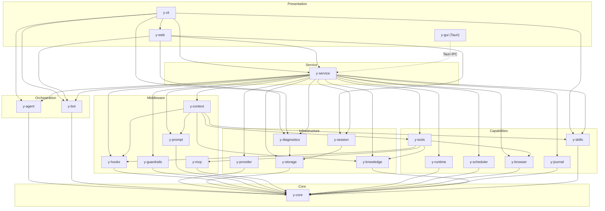

# Crate Map

The workspace contains **24 crates** organized by concern.

## Core

| Crate | Description |
|-------|-------------|
| `y-core` | Trait definitions (`LlmProvider`, `Tool`, `Middleware`, `SessionStore`, etc.), shared types, error types. All cross-crate contracts live here. |

## Infrastructure

| Crate | Description |
|-------|-------------|
| `y-provider` | LLM provider pool with tag-based routing, freeze/thaw, priority scheduling, lease management, metrics export. Backends: OpenAI, Anthropic, Gemini, Azure OpenAI, Ollama. |
| `y-session` | Session lifecycle manager: state machine, tree traversal, canonical (cross-channel) session management, chat checkpoint/rollback. |
| `y-context` | Context assembly pipeline (8 stages), compaction engine, context window guard, memory recall, working memory, history repair, pruning. |
| `y-storage` | SQLite persistence: session store, checkpoint storage, transcript (JSONL), chat messages, workflow store, schedule store, provider metrics store. |
| `y-knowledge` | Knowledge base: multi-level chunking (L0/L1/L2), BM25 + vector hybrid retrieval, ingestion pipeline, domain classification, metadata tagging, quality filtering. |
| `y-diagnostics` | Trace storage (SQLite-backed), cost intelligence, trace search/replay, event-bus subscriber for runtime observation capture. |

## Middleware

| Crate | Description |
|-------|-------------|
| `y-hooks` | Hook system, priority-sorted middleware chains (5 domains: Context, Tool, LLM, Compaction, Memory), async event bus, hook handler executor. |
| `y-guardrails` | Permission model (allow/notify/ask/deny), loop guard (4 pattern detectors), taint tracking, risk scoring, HITL escalation, structural validation. |
| `y-prompt` | Prompt sections with priority/budget/conditions, prompt templates with mode overlays, section store, token estimation. |
| `y-mcp` | Model Context Protocol client: stdio/HTTP transports, tool discovery (`tools/list`), tool call proxying (`tools/call`). |

## Capabilities

| Crate | Description |
|-------|-------------|
| `y-tools` | Tool registry (4 types: builtin/dynamic/MCP/browser), lazy loading with LRU activation, JSON Schema validation, multi-format parser, rate limiter, result formatter. |
| `y-skills` | Skill ingestion, transformation, registry, git-like versioning (content-addressable + JSONL reflog), tag/trigger search, feature-gated modules (ingestion, transformation, security screening, evolution). |
| `y-runtime` | Execution backends: Native, Docker, SSH. Capability-based security (network/filesystem/container/process), audit trail, resource monitor, venv management (Python/Bun). |
| `y-scheduler` | Scheduled task execution: cron (5-field), interval, one-time, event-driven triggers. Schedule store, executor, dispatcher, recovery. |
| `y-browser` | Browser automation via Chrome DevTools Protocol. CDP WebSocket client, session lifecycle, page actions (navigate, click, screenshot), security policy (domain allowlist, SSRF protection), Chrome auto-launcher. |
| `y-journal` | File change journal: tool middleware that captures pre/post file state, scope-based rollback, hash-based conflict detection, per-session file history with rewind support. |

## Orchestration

| Crate | Description |
|-------|-------------|
| `y-agent` | DAG engine (typed channels, checkpointing, interrupt/resume) + agent lifecycle (TOML definitions, registry, pool, delegation protocol, trust tiers). |
| `y-bot` | Bot platform adapters: Feishu (webhook), Discord (Gateway WebSocket + REST API + webhook), Telegram (webhook). Unified `BotPlatform` trait. |

## Service

| Crate | Description |
|-------|-------------|
| `y-service` | Business logic layer (DI container): `ChatService`, `AgentService`, `BotService`, `WorkflowService`, `KnowledgeService`, `SkillService`, `SchedulerService`, `CostService`, `DiagnosticsService`, `SystemService`. Orchestrators for plan execution, task delegation, tool search, user interaction. |

## Presentation

| Crate | Description |
|-------|-------------|
| `y-cli` | CLI + TUI (clap + ratatui). Subcommands: `chat`, `init`, `status`, `config`, `session`, `tool`, `agent`, `workflow`, `diag`, `skill`, `kb`, `tui`, `serve`. |
| `y-web` | REST API server (axum). Route groups: health, chat, sessions, agents, tools, diagnostics, bots, workflows, schedules. CORS enabled. |
| `y-gui` | Desktop GUI (Tauri v2 + React 19 + TypeScript). Views: Chat, Automation (DAG editor), Skills, Knowledge, Agents, Settings. Components for observation/diagnostics. |

## Testing

| Crate | Description |
|-------|-------------|
| `y-test-utils` | Mock implementations of y-core traits (provider, runtime, storage), fixture factories, assertion helpers. |

## Dependency Graph

