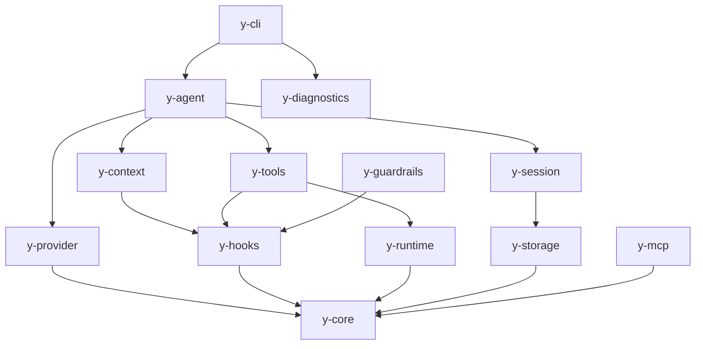

# Crate Map

The workspace contains **24 crates** organized by concern.

## Core

| Crate | Description |
|-------|-------------|
| `y-core` | Trait definitions, shared types, error types |

## Infrastructure

| Crate | Description |
|-------|-------------|
| `y-provider` | LLM provider pool (OpenAI, Anthropic, Gemini, Azure, Ollama), tag routing, streaming |
| `y-session` | Session tree, transcript, branching |
| `y-context` | Context pipeline, token budget, memory integration |
| `y-storage` | SQLite / PostgreSQL / Qdrant backends |
| `y-knowledge` | Knowledge base chunking, indexing, hybrid retrieval |
| `y-diagnostics` | Tracing, metrics, health checks |

## Middleware

| Crate | Description |
|-------|-------------|
| `y-hooks` | Middleware chains, event bus, plugin loading |
| `y-guardrails` | Content filtering, PII detection, safety middleware |
| `y-prompt` | Prompt sections, templates, TOML store |
| `y-mcp` | Model Context Protocol client / server |

## Capabilities

| Crate | Description |
|-------|-------------|
| `y-tools` | Tool registry, JSON Schema validation, multi-format parser |
| `y-skills` | Skill discovery, validation, manifest |
| `y-runtime` | Native / Docker / SSH sandbox execution |
| `y-scheduler` | Cron / interval scheduling, workflow triggers |
| `y-browser` | Browser tool via Chrome DevTools Protocol |
| `y-journal` | File change journal, rollback engine |

## Orchestration

| Crate | Description |
|-------|-------------|
| `y-agent` | Orchestrator, DAG engine, multi-agent pool, delegation |
| `y-bot` | Bot adapters (Discord, Feishu, Telegram) |

## Service

| Crate | Description |
|-------|-------------|
| `y-service` | Business logic layer -- `ChatService`, `AgentService`, `BotService`, `WorkflowService`, `KnowledgeService`, `SkillService`, `SchedulerService`, DI container |

## Presentation

| Crate | Description |
|-------|-------------|
| `y-cli` | CLI + TUI (clap + ratatui) |
| `y-web` | REST API server (axum) with bot adapter routing |
| `y-gui` | Desktop GUI (Tauri v2 + React 19 + TypeScript) |

## Testing

| Crate | Description |
|-------|-------------|
| `y-test-utils` | Mocks, fixtures, assertion helpers |

## Dependency Graph

