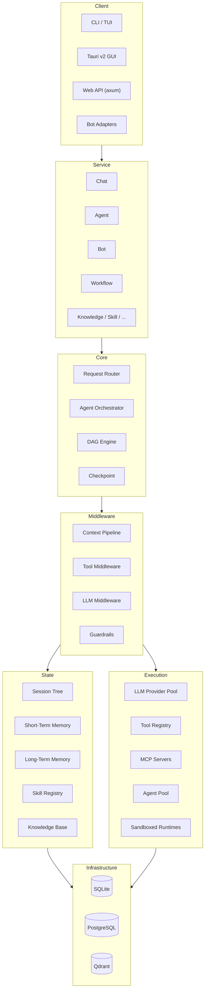

# Architecture Overview

y-agent is organized into **7 architectural layers**, from user-facing clients down to persistent infrastructure.

## System Diagram



## Layer Responsibilities

| Layer | Purpose |
|-------|---------|
| **Client** | Thin I/O wrappers -- CLI, TUI, Tauri GUI, REST API, bot adapters |
| **Service** | Business logic -- Chat, Agent, Bot, Workflow, Knowledge, Skill, Scheduler, Observability, DI container |
| **Core** | Request routing, agent orchestration, DAG engine with typed channels and checkpointing |
| **Middleware** | Context pipeline, tool middleware, LLM middleware, guardrails, async event bus |
| **Execution** | LLM provider pool with tag routing and failover, tool registry (built-in + dynamic + MCP), sandboxed runtimes |
| **State** | Session tree, three-tier memory (STM / LTM / WM), skill registry, knowledge base, file journal |
| **Infrastructure** | SQLite (operational state), PostgreSQL (diagnostics / analytics), Qdrant (semantic vectors) |

## Design Principles

1. **Trait-driven contracts** -- All inter-crate communication via `y-core` traits
2. **Middleware-first** -- Cross-cutting concerns (guardrails, logging, caching) as middleware
3. **Lazy loading** -- Tools and skills loaded on demand to minimize context window usage
4. **Checkpoint everything** -- DAG execution state persisted at every step for crash recovery

## Chat Request Lifecycle

```
User Input
  -> CLI (parse, validate)
  -> Session (load/create)
  -> Context Assembly (7-stage middleware)
    1. BuildSystemPrompt
    2. InjectBootstrap
    3. InjectMemory
    4. InjectKnowledge
    5. InjectSkills
    6. InjectTools
    7. InjectContextStatus
  -> LLM Provider (chat completion)
  -> Tool Dispatch (if tool calls present)
    -> JSON Schema validation
    -> Guardrail check
    -> Runtime execution
    -> Result injection
  -> Loop back to LLM (if needed)
  -> Response to user
  -> Transcript save
  -> Memory extraction (async)
```

## Key Traits

| Trait | Crate | Purpose |
|-------|-------|---------|
| `LlmProvider` | y-core | LLM API abstraction |
| `RuntimeAdapter` | y-core | Sandboxed execution |
| `Tool` | y-core | Tool execution |
| `ToolRegistry` | y-core | Tool discovery/lookup |
| `Middleware` | y-core | Chain-based data transformation |
| `CheckpointStorage` | y-core | Workflow state persistence |
| `SessionStore` | y-core | Session metadata CRUD |
| `TranscriptStore` | y-core | Message history |
| `HookHandler` | y-core | Lifecycle observers |

## Storage Architecture

| Backend | Purpose | Data |
|---------|---------|------|
| **SQLite** | Operational state | Sessions, checkpoints, config |
| **PostgreSQL** | Diagnostics | Traces, costs, observations |
| **Qdrant** | Semantic search | Memory embeddings |
