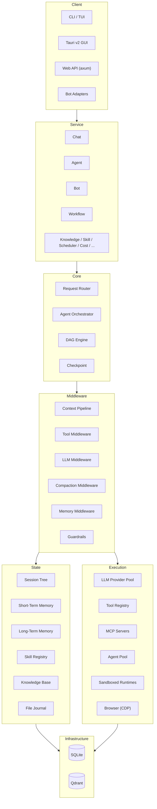

# Architecture Overview

y-agent is organized into **7 architectural layers**, from user-facing clients down to persistent infrastructure.

## System Diagram



## Layer Responsibilities

| Layer | Purpose |
|-------|---------|
| **Client** | Thin I/O wrappers -- CLI, TUI, Tauri GUI, REST API, bot adapters |
| **Service** | Business logic -- Chat, Agent, Bot, Workflow, Knowledge, Skill, Scheduler, Cost, Diagnostics, System; DI container (`ServiceContainer`) |
| **Core** | Request routing, agent orchestration, DAG engine with typed channels and checkpointing |
| **Middleware** | 5-domain middleware chains (Context, Tool, LLM, Compaction, Memory), guardrails, async event bus |
| **Execution** | LLM provider pool with tag routing/failover/freeze-thaw, tool registry (builtin + dynamic + MCP + browser), sandboxed runtimes (Native/Docker/SSH) |
| **State** | Session tree, three-tier memory (STM / LTM / WM), skill registry with versioning, knowledge base with hybrid retrieval, file journal with rollback |
| **Infrastructure** | SQLite (sessions, checkpoints, transcripts, traces, schedules, workflows, provider metrics), Qdrant (semantic vector search for memory and knowledge) |

## Design Principles

1. **Trait-driven contracts** -- All inter-crate communication via `y-core` traits
2. **Middleware-first** -- Cross-cutting concerns (guardrails, logging, journaling) as middleware in 5 chains
3. **Lazy loading** -- Tools and skills loaded on demand to minimize context window usage
4. **Checkpoint everything** -- DAG execution state persisted at every step for crash recovery
5. **Service-layer ownership** -- All business logic in `y-service`; presentation crates are thin I/O wrappers

## Chat Request Lifecycle

```
User Input
  -> CLI / GUI / API (parse, validate)
  -> Session (load/create via SessionManager)
  -> Context Assembly (8-stage pipeline)
    1. BuildSystemPrompt
    2. InjectBootstrap
    3. InjectMemory
    4. InjectKnowledge
    5. InjectSkills
    6. InjectTools
    7. LoadHistory
    8. InjectContextStatus
  -> LLM Provider (chat completion via ProviderPool)
  -> Tool Dispatch (if tool calls present)
    -> Multi-format parser (OpenAI, DeepSeek, MiniMax, GLM4, Qwen3Coder, ...)
    -> JSON Schema validation
    -> Guardrail check (permission + risk scoring)
    -> File journal capture (if file-mutating)
    -> Runtime execution (Native / Docker)
    -> Result formatting and injection
  -> Loop back to LLM (if needed)
  -> Response to user
  -> Transcript save
  -> Memory extraction (async)
  -> Diagnostics trace recording
```

## Key Traits (y-core)

| Trait | Module | Purpose |
|-------|--------|---------|
| `LlmProvider` | `provider` | LLM API abstraction (chat completion, streaming) |
| `ProviderPool` | `provider` | Tag-based provider routing and failover |
| `Tool` | `tool` | Tool execution contract |
| `ToolRegistry` | `tool` | Tool discovery, lookup, and search |
| `Middleware` | `hook` | Chain-based data transformation (priority-sorted) |
| `HookHandler` | `hook` | Lifecycle event observers |
| `EventSubscriber` | `hook` | Async event bus subscriber |
| `HookLlmRunner` | `hook` | LLM execution within hook handlers |
| `HookAgentRunner` | `hook` | Agent execution within hook handlers |
| `RuntimeAdapter` | `runtime` | Sandboxed execution backend |
| `CommandRunner` | `runtime` | Shell command execution |
| `SessionStore` | `session` | Session metadata CRUD |
| `TranscriptStore` | `session` | Message history persistence |
| `DisplayTranscriptStore` | `session` | Formatted transcript for display |
| `ChatCheckpointStore` | `session` | Turn-level checkpoint and rollback |
| `ChatMessageStore` | `session` | Chat message persistence |
| `CheckpointStorage` | `checkpoint` | Workflow checkpoint persistence |
| `MemoryClient` | `memory` | Memory read/write operations |
| `ExperienceStore` | `memory` | Experience capture for skill evolution |
| `SkillRegistry` | `skill` | Skill discovery, search, loading |
| `EmbeddingProvider` | `embedding` | Vector embedding generation |
| `AgentDelegator` | `agent` | Multi-agent delegation protocol |
| `AgentRunner` | `agent` | Single-turn agent execution |
| `ClassifiedError` | `error` | Error classification for retry/reporting |
| `Redactable` | `error` | Secret redaction in error messages |

## Storage Architecture

| Backend | Purpose | Data |
|---------|---------|------|
| **SQLite** | Operational state | Sessions, checkpoints, transcripts, traces, costs, schedules, workflows, provider metrics |
| **Qdrant** | Semantic search | Memory embeddings, knowledge base vectors |
