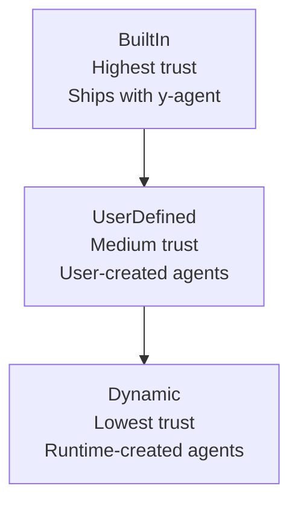
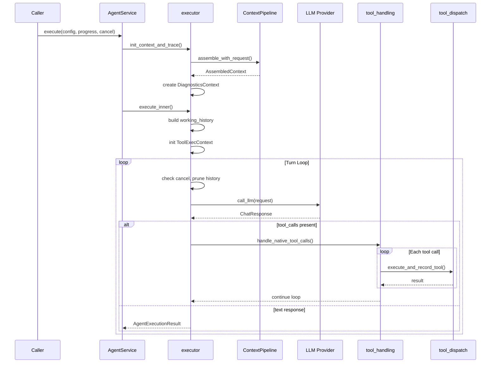
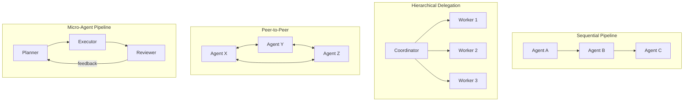
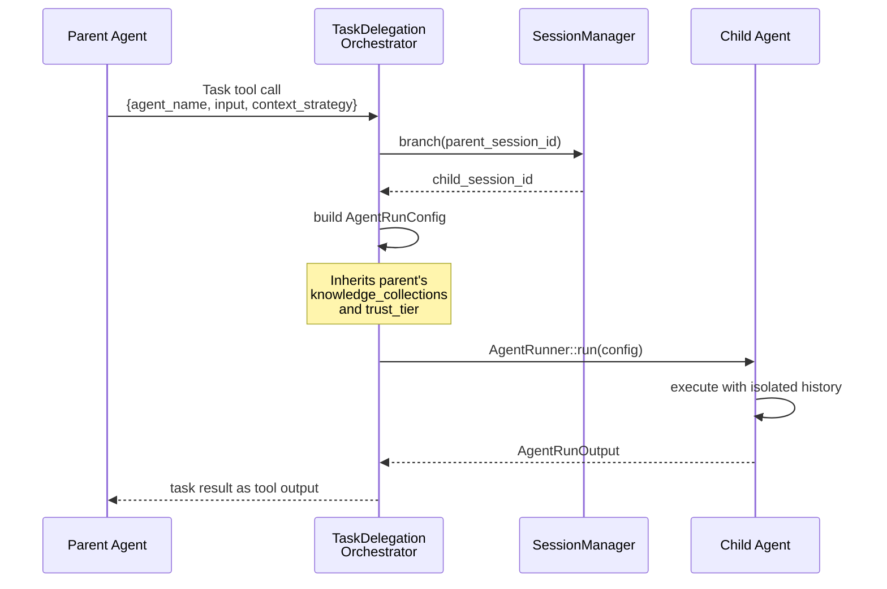
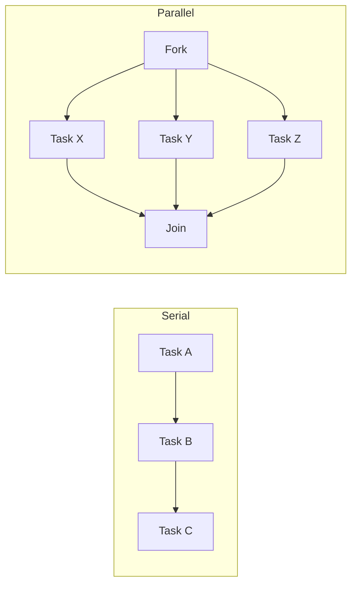

# Agent System

The agent system is the **sole entry point for all LLM reasoning** in y-agent. Every operation that involves LLM inference -- including compaction, enrichment, capability-gap assessment -- is expressed as an agent delegation.

## Core Concepts

### Agent Definition

Agents are declared via TOML configuration:

```toml
[agent]
name = "code-reviewer"
description = "Reviews code for quality and correctness"
mode = "build"                    # build | plan | explore | general
system_prompt = "You are a code reviewer..."

[agent.model]
preferred = ["claude-sonnet-4-6"]
fallback = ["gpt-4o"]
provider_tags = ["fast"]

[agent.capabilities]
allowed_tools = ["FileRead", "ShellExec", "ToolSearch"]
max_iterations = 15
trust_tier = "user_defined"       # built_in | user_defined | dynamic
```

### Trust Tiers



| Tier | Tool Access | Auto-Allow | Created By |
|------|------------|------------|------------|
| BuiltIn | Full access to allowed_tools without permission prompts | Yes | System |
| UserDefined | Access to allowed_tools, may prompt for dangerous tools | Partial | User config |
| Dynamic | Restricted access, always prompts for dangerous tools | No | Agent at runtime |

### Agent Modes

| Mode | Purpose | Prompt Sections Toggled |
|------|---------|----------------------|
| `build` | Implementation and coding tasks | Tools, file operations, shell |
| `plan` | Architecture and planning | Planning templates, no execution tools |
| `explore` | Codebase exploration and research | Read-only tools, search, knowledge |
| `general` | General-purpose conversation | Default section set |

Mode overlays toggle prompt sections without duplicating content -- the same section can appear in multiple modes with different priorities.

## Execution Architecture



### ToolExecContext

The mutable state carried through the execution loop:

```
ToolExecContext {
    iteration: usize,              // current loop iteration
    tool_calls_executed: Vec,      // all tool calls made
    cumulative_input_tokens: u64,  // total input tokens
    cumulative_output_tokens: u64, // total output tokens
    cumulative_cost: f64,          // total cost in USD
    working_history: Vec<Message>, // current message history
    new_messages: Vec<Message>,    // messages generated this turn
    dynamic_tool_defs: Vec,        // tools activated via ToolSearch
    accumulated_content: String,   // text content across iterations
    iteration_texts: Vec<String>,  // per-iteration text snapshots
    cancel_token: CancellationToken,
    pending_permissions: HashMap,  // oneshot channels for HITL
    pending_interactions: HashMap, // oneshot channels for AskUser
}
```

## Multi-Agent Collaboration

### 4 Collaboration Patterns



#### Sequential Pipeline
Agents execute in order, each receiving the previous agent's output as input. Used for multi-stage processing (e.g., plan -> implement -> review).

#### Hierarchical Delegation
A coordinator agent delegates subtasks to worker agents. The `Task` meta-tool triggers `TaskDelegationOrchestrator`, which spawns sub-agents with isolated sessions.

#### Peer-to-Peer
Agents communicate directly through shared state channels. Used for collaborative problem-solving.

#### Micro-Agent Pipeline
Specialized agents in a feedback loop. A planner creates a plan, an executor implements it, a reviewer validates -- with feedback flowing back to the planner.

### Delegation Protocol



**Context Strategy** controls what the child agent sees:

| Strategy | Description |
|----------|-------------|
| `None` | Child gets only the task input, no parent context |
| `Summary` | Child gets an LLM-generated summary of parent context |
| `Filtered` | Child gets parent context filtered by relevance |
| `Full` | Child gets full parent context (most expensive) |

### Agent Pool

`AgentPool` enforces concurrent agent limits:

- Default max: 5 concurrent agents
- Enforced via `tokio::Semaphore`
- Each delegation acquires a permit before spawning
- Permits released when the child agent completes or errors
- Prevents runaway agent spawning in recursive delegation chains

### Dynamic Agent Creation

Agents can autonomously create other agents at runtime via meta-tools:

| Meta-Tool | Purpose |
|-----------|---------|
| `agent_create` | Define a new agent with role, tools, and instructions |
| `agent_update` | Modify an existing dynamic agent's configuration |

Dynamic agents always receive `TrustTier::Dynamic` (lowest trust). They cannot escalate their own trust tier or create agents with higher trust.

## DAG Workflow Engine

The orchestrator module provides a DAG-based workflow engine for structured multi-step execution.

### Task Patterns



| Pattern | Description |
|---------|-------------|
| Serial | Tasks execute in dependency order |
| Parallel(All) | All branches must complete |
| Parallel(Any) | First completion wins, others cancelled |
| Parallel(AtLeast(n)) | At least n branches must complete |
| Conditional | Branch selected based on runtime predicate |
| Loop | Repeated execution with exit condition |

### State Channels

Typed state channels allow tasks to share data:

| Reducer | Behavior |
|---------|----------|
| `LastValue` | Latest write wins |
| `Append` | All writes concatenated |
| `Merge` | Deep merge of JSON objects |
| `Custom` | User-defined reducer function |

### Checkpointing

Task-level checkpointing enables granular recovery:

1. After each task completes, the DAG state is serialized to SQLite
2. On crash recovery, only failed/incomplete tasks are re-executed
3. Completed tasks' outputs are loaded from checkpoints
4. Interrupt/resume protocol supports HITL pauses at task boundaries

### Workflow Definition Formats

Workflows can be defined in two formats:

**TOML Template** -- stored in `WorkflowStore`, reusable:
```toml
[workflow]
name = "code-review"
description = "Automated code review pipeline"

[[workflow.tasks]]
name = "analyze"
agent = "code-analyzer"
input = "{{source_code}}"

[[workflow.tasks]]
name = "review"
agent = "code-reviewer"
depends_on = ["analyze"]
input = "{{analyze.output}}"
```

**Expression DSL** -- inline, for dynamic workflows:
```
analyze(agent="code-analyzer") -> review(agent="code-reviewer")
```

### Stream Modes

| Mode | Output |
|------|--------|
| `None` | No streaming, final result only |
| `Values` | State channel value updates |
| `Updates` | Task status transitions |
| `Messages` | Agent message events |
| `Debug` | Full execution trace |
