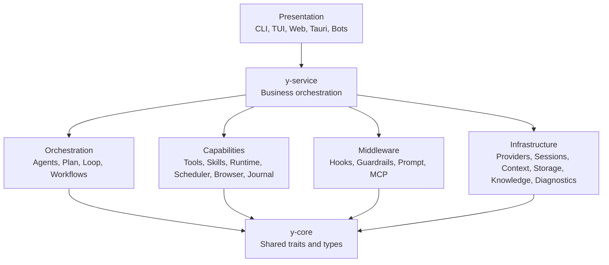

# Harness Architecture

y-agent is a Rust-first Agent Harness in the same systems category as Codex. It
wraps language models with the execution machinery required for real work:
goals, context, plans, tools, delegation, permissions, recovery, and
observability.

## Execution Loop

```text
User goal
  -> choose fast, plan, or loop execution
  -> assemble context, knowledge, skills, tools, and history
  -> call a routed model provider
  -> execute tools, workflows, or sub-agents
  -> apply guardrails and request approval when required
  -> persist checkpoints, transcripts, journals, and diagnostics
  -> return a result or resumable state
```

## Layers



`y-service` owns business logic. Presentation layers translate I/O and render
state; they do not implement domain workflows.

## Core Harness Capabilities

### Goal continuity

Goals, constraints, decisions, and progress are preserved in working memory and
structured handoff documents. Goal is currently an execution semantic rather
than an independent persistent CRUD resource.

### Plan and loop execution

- Fast mode handles direct tasks without a structured plan.
- Plan mode creates a reviewable plan and executes dependency-aware phases.
- Loop mode performs work and self-review iteratively until it converges or
  reaches configured limits.

### Self-orchestration

Agents can delegate to sub-agents and create or execute reusable workflows. The
DAG engine provides typed state, checkpoints, interrupts, retry policy, and
bounded concurrency.

### Knowledge and skills

Knowledge stores external domain material and supports ingestion, metadata,
multi-resolution chunks, and hybrid retrieval. Skills store reusable reasoning
and operating instructions and are loaded on demand.

### Self-evolution

Completed work can produce experience records. The skill pipeline extracts
patterns, creates versioned proposals, performs validation and regression
checks, and keeps approval and lineage explicit.

### Safety and recovery

Sandboxing, guardrails, permission rules, and HITL approval protect side
effects. SQLite WAL state, workflow checkpoints, transcripts, file journaling,
and rewind support recovery.

### Observability

The diagnostics subsystem records traces, generations, tools, sub-agents,
tokens, cost, status, scores, and replay data. Optional Langfuse export is
asynchronous and failure-isolated.

The current Langfuse bridge uses Langfuse's native ingestion API. A general
OpenTelemetry SDK/exporter is an extension target, not a currently wired
workspace feature.

## Source of Truth

For contributor-level boundaries and implementation paths, use
`docs/guides/ARCHITECTURE.md` in the repository. Current code, tests, Cargo
features, and generated CLI help take precedence over copied implementation
lists.
