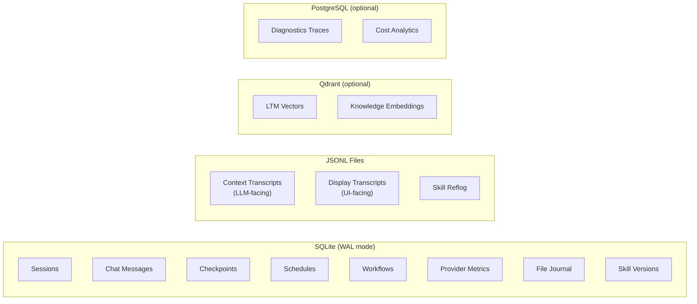

# System Architecture

y-agent follows a strict **6-layer architecture** where dependencies always point inward. Each layer has a clear responsibility boundary.

## Layer Diagram

```mermaid
graph TB
    subgraph Presentation["Presentation Layer"]
        CLI["y-cli<br/>CLI + TUI"]
        WEB["y-web<br/>REST API"]
        GUI["y-gui<br/>Tauri Desktop"]
    end

    subgraph Service["Service Layer"]
        SVC["y-service<br/>ServiceContainer<br/>ChatService | AgentService<br/>WorkflowService | BotService"]
    end

    subgraph Orchestration["Orchestration Layer"]
        AGT["y-agent<br/>DAG Engine<br/>Agent Registry"]
        BOT["y-bot<br/>Platform Adapters"]
    end

    subgraph Middleware["Middleware Layer"]
        HOOKS["y-hooks<br/>Chain Runner"]
        GUARD["y-guardrails<br/>LoopGuard | HITL"]
        PROMPT["y-prompt<br/>Template Engine"]
        MCP["y-mcp<br/>Protocol Bridge"]
    end

    subgraph Capabilities["Capabilities Layer"]
        TOOLS["y-tools<br/>Registry + Executor"]
        SKILLS["y-skills<br/>Ingestion + Versioning"]
        RT["y-runtime<br/>Sandbox"]
        SCHED["y-scheduler<br/>Cron + Interval"]
        BROWSER["y-browser<br/>CDP Client"]
        JOURNAL["y-journal<br/>File Snapshots"]
    end

    subgraph Infrastructure["Infrastructure Layer"]
        PROV["y-provider<br/>Pool + Router"]
        SESS["y-session<br/>State Machine"]
        CTX["y-context<br/>Pipeline"]
        STORE["y-storage<br/>SQLite + JSONL"]
        KB["y-knowledge<br/>BM25 + Vector"]
        DIAG["y-diagnostics<br/>Traces + Cost"]
    end

    subgraph Core["Core Layer"]
        YCORE["y-core<br/>Traits + Types"]
    end

    CLI --> SVC
    WEB --> SVC
    GUI --> SVC

    SVC --> AGT
    SVC --> BOT
    SVC --> HOOKS
    SVC --> GUARD
    SVC --> PROMPT
    SVC --> MCP
    SVC --> TOOLS
    SVC --> SKILLS
    SVC --> RT
    SVC --> SCHED
    SVC --> BROWSER
    SVC --> JOURNAL
    SVC --> PROV
    SVC --> SESS
    SVC --> CTX
    SVC --> STORE
    SVC --> KB
    SVC --> DIAG

    AGT --> YCORE
    TOOLS --> YCORE
    PROV --> YCORE
    SESS --> YCORE
    CTX --> YCORE
    STORE --> YCORE
    KB --> YCORE
    SKILLS --> YCORE
    RT --> YCORE
    HOOKS --> YCORE
    GUARD --> YCORE
    DIAG --> YCORE
```

## Layer Responsibilities

### 1. Core (`y-core`)

The boundary-defining crate. Contains **only** trait definitions and shared types -- zero business logic.

| Trait | Purpose |
|-------|---------|
| `LlmProvider` | `chat_completion()`, `chat_completion_stream()`, `metadata()` |
| `ProviderPool` | Multi-provider routing with freeze/thaw |
| `Tool` | `execute()`, `definition()`, `check_permissions()` |
| `ToolRegistry` | Tool index, search, register/unregister |
| `RuntimeAdapter` | `execute()`, `spawn()`, `kill()`, `health_check()` |
| `Middleware` | `execute()`, `chain_type()`, `priority()` |
| `AgentRunner` | `run(AgentRunConfig) -> AgentRunOutput` |
| `AgentDelegator` | Cross-crate agent delegation without circular deps |

Key types: `Message`, `ChatRequest`, `ChatResponse`, `ToolDefinition`, `SessionNode`, `Memory`, `TokenUsage`.

### 2. Infrastructure

Safely abstracts all external state. No business logic -- only persistence, retrieval, and protocol adaptation.

| Crate | Responsibility |
|-------|---------------|
| `y-provider` | LLM provider pool with tag-based routing, freeze/thaw failover, priority scheduling |
| `y-session` | Session lifecycle state machine, tree traversal, transcripts |
| `y-context` | Context assembly pipeline, compaction engine, pruning, working memory |
| `y-storage` | SQLite (WAL) backends, JSONL transcript writers, migration runner |
| `y-knowledge` | External knowledge ingestion, BM25 + vector hybrid retrieval, multi-resolution chunking |
| `y-diagnostics` | Trace storage, cost intelligence, search, replay |

### 3. Middleware

Intercepts and transforms data flowing through the system.

| Crate | Responsibility |
|-------|---------------|
| `y-hooks` | Middleware chain execution, event bus, hook registry |
| `y-guardrails` | Loop detection, permission model, taint tracking, risk scoring, HITL protocol |
| `y-prompt` | Prompt template engine with mode overlays, section budgets, lazy loading |
| `y-mcp` | Model Context Protocol client (stdio + HTTP), tool adapter, connection manager |

### 4. Capabilities

Discrete functional units.

| Crate | Responsibility |
|-------|---------------|
| `y-tools` | Tool registry (4 types), lazy activation (LRU), JSON Schema validation, multi-format parser |
| `y-skills` | Skill ingestion pipeline, content-addressable versioning, security screening, evolution capture |
| `y-runtime` | Docker / Native (bubblewrap) / SSH sandbox execution, resource monitoring, audit trail |
| `y-scheduler` | Cron / interval / one-time / event scheduling, concurrency policy, missed-run handling |
| `y-browser` | Chrome DevTools Protocol client, SSRF protection, search result extraction |
| `y-journal` | File mutation journaling, three-tier storage (inline / blob / git-ref), rollback |

### 5. Orchestration

Coordination of agents and external platform adapters.

| Crate | Responsibility |
|-------|---------------|
| `y-agent` | DAG workflow engine, typed state channels, agent registry, delegation protocol, trust tiers |
| `y-bot` | Feishu / Discord / Telegram platform adapters, event parsing, message routing |

### 6. Service (`y-service`)

The **sole orchestration hub**. All business logic lives here. `ServiceContainer` is the DI root that wires every domain service from config.

### 7. Presentation

Thin I/O wrappers. No domain logic.

| Crate | Transport | Details |
|-------|-----------|---------|
| `y-cli` | stdin/stdout | clap CLI + ratatui TUI, 15+ subcommands |
| `y-web` | HTTP | axum REST API, SSE streaming, CORS |
| `y-gui` | IPC | Tauri v2 + React 19, in-process `ServiceContainer` (zero network overhead) |

## Data Store Architecture

## Dependency Rules

1. **All arrows point inward** -- an outer layer may depend on an inner layer but never the reverse
2. **`y-core` has zero dependencies** on other workspace crates
3. **Presentation crates depend only on `y-service`** -- never on infrastructure or capabilities directly
4. **`y-service` is the only crate** that may depend on all other layers
5. **Cross-layer peer dependencies** (e.g., `y-tools` -> `y-hooks`) are permitted within the same layer or from outer to inner
6. **Every new subsystem** must be behind a Cargo feature flag

## Concurrency Model

y-agent is async-first on **Tokio**. Key concurrency patterns:

- **Provider pool**: per-provider semaphores + optional global semaphore for system-wide concurrency cap
- **Agent pool**: `max_concurrent_agents` (default 5) enforced via `tokio::Semaphore`
- **Tool execution**: sequential within a turn (tool calls processed in order), parallel across agents
- **Session access**: `Arc<RwLock<...>>` for shared state, optimistic locking for transcript writes
- **Event bus**: `tokio::broadcast` channels for hook notifications
- **Cancellation**: `CancellationToken` propagated through every async operation
