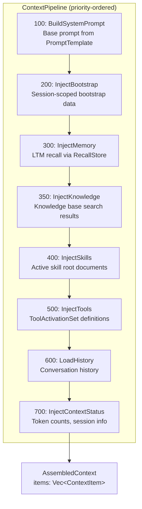
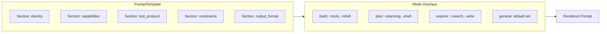
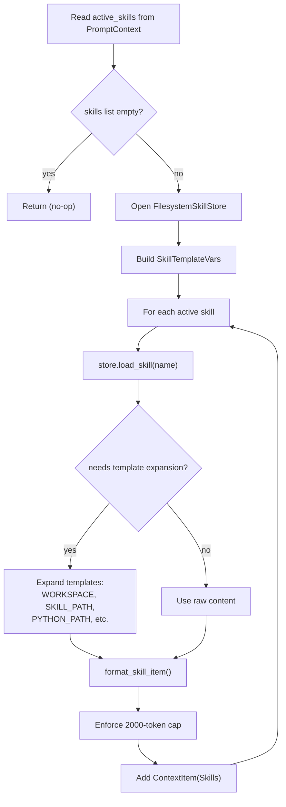
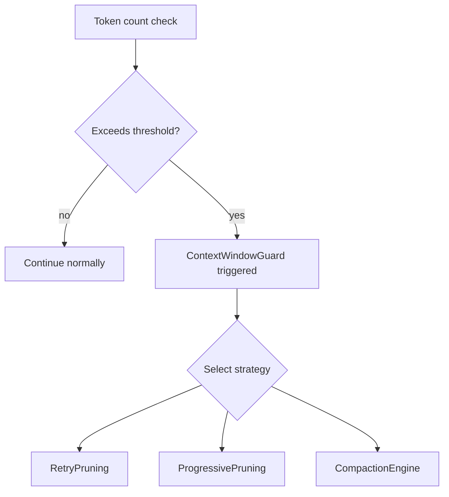
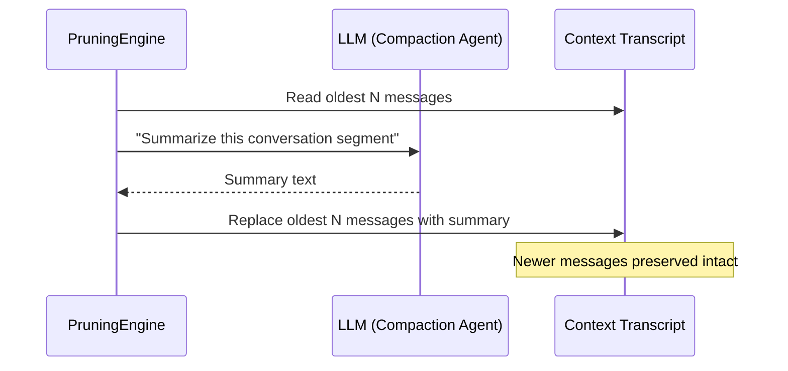
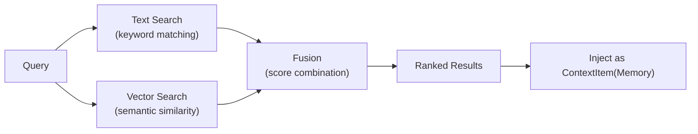
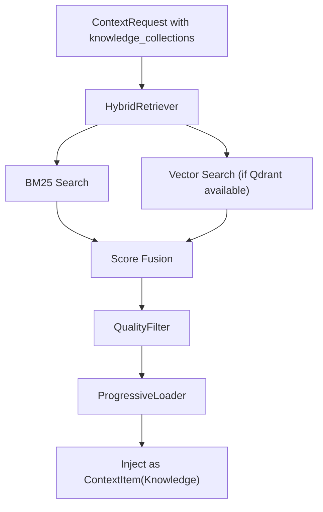

# Context Pipeline

The context pipeline assembles the full prompt sent to the LLM. It handles context budget management, compaction, pruning, and memory recall.

## Pipeline Architecture



## Assembly Process

**Entry:** `ContextPipeline::assemble_with_request()` in `y-context/src/pipeline.rs`

1. Create empty `AssembledContext`
2. Iterate registered `ContextProvider` implementations in ascending priority order
3. Each provider calls `provide(&mut assembled_context)`, appending `ContextItem` entries
4. On error: log warning and continue (fail-open -- partial context is better than no context)

### ContextItem Structure

```
ContextItem {
    category: ContextCategory,  // SystemPrompt | Bootstrap | Memory | ...
    content: String,            // actual text injected into prompt
    token_estimate: u32,        // estimated tokens for budget tracking
    priority: u32,              // ordering within category
}
```

### ContextCategory

| Category | Priority | Source |
|----------|----------|--------|
| `SystemPrompt` | 100 | `PromptTemplate` with mode overlays |
| `Bootstrap` | 200 | Session initialization data |
| `Memory` | 300 | `RecallStore` (hybrid text/vector) |
| `Knowledge` | 350 | `HybridRetriever` (BM25 + vector) |
| `Skills` | 400 | `FilesystemSkillStore` with template expansion |
| `Tools` | 500 | `ToolActivationSet` (LRU-managed definitions) |
| `History` | 600 | Context transcript messages |
| `Status` | 700 | Token counts, session metadata |

## Prompt System

### PromptTemplate

The prompt system uses composable sections with mode overlays:



**Key features:**
- Sections are typed, prioritized, and token-budgeted
- Mode overlays toggle sections without content duplication
- Lazy loading: sections only materialized when their conditions are met
- `SectionCondition` evaluates against `PromptContext` at render time

### PromptSection

```
PromptSection {
    id: SectionId,
    category: SectionCategory,
    content_source: ContentSource,   // Inline | File | Template
    condition: Option<SectionCondition>,
    priority: u32,
    max_tokens: Option<u32>,
}
```

### Token Budget

- `estimate_tokens()` -- fast heuristic token estimation
- `truncate_to_budget()` -- truncates content to fit within a token limit
- `truncate_tool_result()` -- hard 10K character cap (`MAX_TOOL_RESULT_CHARS`)
- Skill root documents: hard 2,000 token cap per skill

## Skill Injection

**Entry:** `InjectSkills::provide()` in `y-context/src/inject_skills.rs`



Template variables:
- `{{WORKSPACE}}` -- working directory path
- `{{SKILL_PATH}}` -- per-skill directory path
- `{{PYTHON_PATH}}` -- Python executable path
- `{{PYTHON_VENV}}` -- Python venv directory
- `{{BUN_PATH}}` -- Bun executable path

## Context Overflow Management

When the context window is exhausted, the system has three complementary strategies:

### ContextWindowGuard

Three trigger modes that activate when token usage approaches the model's context limit:



### RetryPruning (Zero LLM Cost)

Used for tool result overflow. Removes or truncates failed tool call branches that the LLM has already seen and reacted to.

```
Before: [user] [assistant+tool_call] [tool_error] [assistant "let me try..."] [assistant+tool_call] [tool_success]
After:  [user] [assistant+tool_call] [tool_success]
```

- Zero LLM cost (no summarization needed)
- Only removes tool calls that were followed by a retry
- Preserves the successful execution path

### ProgressivePruning (Rolling Summary)

Used for history overflow. The LLM generates a rolling summary of older conversation turns.



- Uses a dedicated compaction agent (agent framework is the sole LLM entry point)
- Rolling window: oldest messages summarized first
- Summary preserves key decisions, outcomes, and context needed for ongoing work

### CompactionEngine

Full conversation compaction when progressive pruning is insufficient:

1. Entire context transcript replaced with a single summary message
2. Display transcript untouched (UI shows full history)
3. Only triggered when progressive pruning cannot free enough tokens

## Intra-Turn Pruning

Between iterations of the agent execution loop, three pruning strategies run:

| Strategy | When | What It Removes |
|----------|------|----------------|
| `IntraTurnPruner::prune_working_history()` | iteration > 0 | Failed tool call branches |
| `prune_old_tool_results()` | configurable | Stale tool outputs from earlier iterations |
| `strip_historical_thinking()` | always | `reasoning_content` from previous turns |

This prevents the working history from growing unboundedly during long tool-use loops.

## Memory Recall

### RecallStore

Hybrid text/vector memory recall:



### Three-Tier Memory Architecture

| Tier | Scope | Storage | Persistence |
|------|-------|---------|-------------|
| Working Memory | Pipeline-scoped | In-memory blackboard | Current pipeline only |
| STM (Short-Term) | Session-scoped | SQLite | Session lifetime |
| LTM (Long-Term) | Global | Qdrant vectors | Permanent |

**Write-then-read consistency:** The `RecallStore` implements a Read Barrier that drains the write queue before any recall query. This ensures that recently stored memories are immediately available for recall without blocking write operations.

## Knowledge Injection

**Entry:** `KnowledgeContextProvider` at priority 350



The `ProgressiveLoader` supports on-demand sub-document loading: only the top-ranked chunks are injected initially, with deeper content loaded if the agent requests it via knowledge tools.
