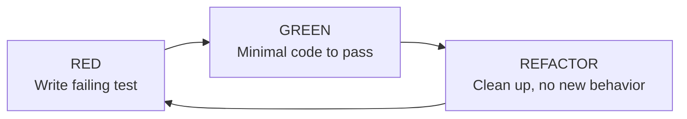
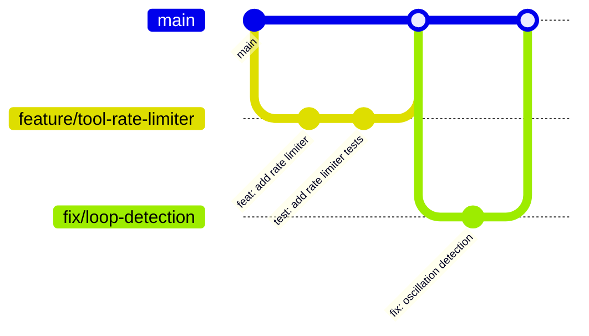

# Contributing

This guide covers the development workflow, quality gates, and collaboration practices for contributing to y-agent.

## Development Setup

### Prerequisites

- **Rust** (latest stable, edition 2021)
- **SQLite** (bundled via sqlx)
- **Node.js + pnpm** (for y-gui frontend)
- **Docker** (optional, for container runtime tests)
- **Qdrant** (optional, for vector search)

### Build

```bash
# Build all workspace crates
cargo build --workspace

# Build with all features
cargo build --workspace --all-features

# Build specific crate
cargo build -p y-service
```

### Run

```bash
# CLI
cargo run --bin y-agent -- chat

# TUI (feature-gated)
cargo run --bin y-agent --features tui -- tui

# Web server
cargo run --bin y-agent -- serve

# GUI (Tauri)
cd crates/y-gui && cargo tauri dev
```

## TDD Workflow

y-agent follows strict TDD: **Red -> Green -> Refactor**.



### Rules

1. **No production code without a preceding test** -- write the test first
2. **Minimal code** -- only write enough code to make the failing test pass
3. **Refactor after green** -- clean up while tests are green
4. **Run tests after every change** -- catch regressions immediately

### Running Tests

```bash
# Run all tests (with output filtering)
cargo test --workspace 2>&1 | grep -v '^\s*Compiling\|^\s*Running\|^\s*Downloading\|^\s*Downloaded\|^\s*Blocking\|^\s*Finished\|^\s*Doc-tests\|^running\|^test \|^$' | head -200

# Run tests for a specific crate
cargo test -p y-core 2>&1 | grep -v '^\s*Compiling\|^\s*Running\|^\s*Downloading\|^\s*Downloaded\|^\s*Blocking\|^\s*Finished\|^\s*Doc-tests\|^running\|^test \|^$' | head -200

# Run a specific test
cargo test -p y-tools test_lazy_loading 2>&1 | grep -v '^\s*Compiling\|^\s*Running\|^\s*Downloading\|^\s*Downloaded\|^\s*Blocking\|^\s*Finished\|^\s*Doc-tests\|^running\|^test \|^$' | head -200
```

Always pipe test output through the grep filter to extract error information and strip noise.

### Test Utilities

`y-test-utils` provides shared mocks:

| Mock | Purpose |
|------|---------|
| `MockProvider` | Simulates LLM responses with `MockBehaviour` |
| `MockRuntime` | Simulates sandbox execution |
| `MockCheckpointStorage` | In-memory checkpoint storage |
| `MockSessionStore` | In-memory session storage |
| `MockTranscriptStore` | In-memory transcript storage |

## Quality Gates

After completing any Rust code change, run these checks **in order** and fix all issues before considering the task done:

```bash
# 1. Format all code
cargo fmt --all

# 2. Auto-fix Clippy suggestions
cargo clippy --fix --allow-dirty --workspace -- -D warnings

# 3. Verify zero Clippy warnings
cargo clippy --workspace -- -D warnings

# 4. Full workspace compilation
cargo check --workspace

# 5. Documentation builds
cargo doc --workspace --no-deps
```

### Gate Details

| Gate | Purpose | Failure Action |
|------|---------|---------------|
| `cargo fmt --all` | Consistent formatting (rustfmt.toml: max_width=100, edition=2021) | Auto-fixed |
| `cargo clippy --fix` | Auto-apply lint suggestions | Auto-fixed |
| `cargo clippy -- -D warnings` | Zero warnings policy | Must fix manually |
| `cargo check --workspace` | Full compilation check | Must fix |
| `cargo doc --workspace --no-deps` | Documentation builds | Must fix |

**No task is complete until all five gates pass cleanly.**

## Code Standards

### Naming Conventions

| Element | Convention | Example |
|---------|-----------|---------|
| Files / functions | `snake_case` | `tool_dispatch.rs`, `execute_turn()` |
| Types / traits | `PascalCase` | `ToolRegistry`, `LlmProvider` |
| Constants | `SCREAMING_SNAKE_CASE` | `MAX_TOOL_RESULT_CHARS` |
| Modules | `snake_case` | `agent_service`, `context_pipeline` |

### Lint Policy

- **No inline lint suppression** -- never add `#[allow(clippy::...)]` to source code
- Fix the lint or add the allow to `[workspace.lints]` in `Cargo.toml` with a comment
- Sole exception: `#[allow(dead_code)]` on struct fields kept for API completeness

### Architecture Rules

1. **Dependencies point inward** to `y-core`
2. **Every new subsystem** behind a feature flag
3. **All business logic** in `y-service`
4. **Presentation crates** are thin I/O wrappers
5. **No domain logic** in `y-cli`, `y-web`, or `y-gui`

### Documentation

- All docs, comments, and commits in **English**
- No emoji anywhere in the repository
- Comments only when the "why" is non-obvious
- Skill root docs <= 2,000 tokens

## Commit Discipline

### Rules

1. **One concern per commit** -- don't mix unrelated changes
2. **Cross-doc changes** in one batch -- if updating multiple design docs, commit together
3. **English commit messages** -- descriptive, conventional-commit style
4. **No secrets** -- never commit API keys, tokens, or credentials

### Commit Message Format

```
feat(y-tools): add rate limiter for tool execution

Implements per-tool rate limiting to prevent runaway loops
before the LoopGuard triggers.
```

Prefixes: `feat`, `fix`, `refactor`, `test`, `docs`, `chore`, `perf`

## Design-First Development

### Before Coding

1. Read the relevant design doc in `docs/design/`
2. Read `DESIGN_OVERVIEW.md` for cross-cutting concerns
3. Implementation must conform to the design
4. If the design is impractical: **update the doc first, then code**

### Risk Tiers

| Tier | Examples | Review |
|------|---------|--------|
| Low | Typo fixes, open question additions | Self-review |
| Medium | New sections, targets, alternatives | Peer review |
| High | Shared concepts, multi-doc changes, `DESIGN_OVERVIEW.md` | Team review |

**When uncertain, assume High.**

### R&D Planning

Before any R&D action, write a plan to `.claude/plans/` covering:
- Scope and objectives
- Step-by-step approach
- Dependencies
- Verification criteria

No implementation until the plan exists.

## Key References

| Document | Location | Purpose |
|----------|----------|---------|
| `DESIGN_OVERVIEW.md` | `docs/design/` | Cross-cutting architecture decisions |
| `DESIGN_RULE.md` | root | Design doc standards and validation |
| `TEST_STRATEGY.md` | `docs/standards/` | TDD methodology, test pyramid |
| `ENGINEERING_STANDARDS.md` | `docs/standards/` | Rust coding standards |
| `DATABASE_SCHEMA.md` | `docs/standards/` | SQLite / Qdrant schema |
| `AGENT_AUTONOMY.md` | `docs/standards/` | Sub-agent autonomy model |
| `DSL_STANDARD.md` | `docs/standards/` | DSL specification |
| `SKILLS_STANDARD.md` | `docs/standards/` | Skill format and authoring |
| `TOOL_CALL_PROTOCOL.md` | `docs/standards/` | Tool call protocol |

## Collaboration Workflow

### Branch Strategy



1. Create a feature branch from `main`
2. Implement with TDD (tests first)
3. Run all quality gates
4. Submit PR for review
5. Merge to `main` after approval

### Code Review Checklist

- [ ] Tests written before production code (TDD)
- [ ] All quality gates pass (fmt, clippy, check, doc)
- [ ] No inline lint suppression added
- [ ] Dependencies point inward (architecture compliance)
- [ ] New subsystem behind feature flag
- [ ] Business logic in `y-service`, not presentation crates
- [ ] No secrets or credentials committed
- [ ] English documentation and comments
- [ ] No emoji in any content
- [ ] Design doc consulted / updated if needed

### Adding a New Crate

1. Create the crate under `crates/`
2. Add to workspace `Cargo.toml`
3. Define traits in `y-core` if the crate introduces new abstractions
4. Wire into `ServiceContainer` in `y-service`
5. Add behind a feature flag
6. Write integration tests in `tests/`
7. Update `DESIGN_OVERVIEW.md` alignment table
8. Update this documentation

### Adding a New Tool

1. Implement the `Tool` trait from `y-core`
2. Define `ToolDefinition` with JSON Schema parameters
3. Register in `ToolRegistryImpl` initialization
4. Set `is_dangerous` appropriately
5. Add tests in the tool's crate
6. Add to the built-in tool table in this documentation
