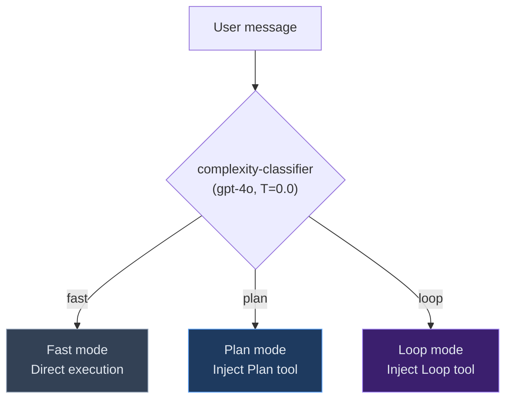
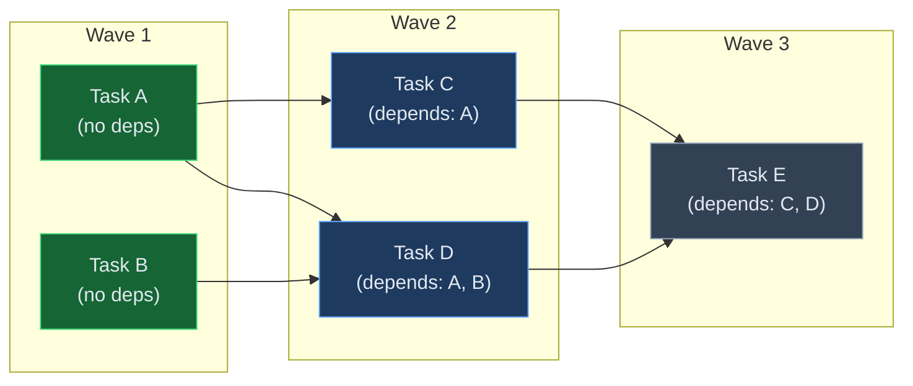
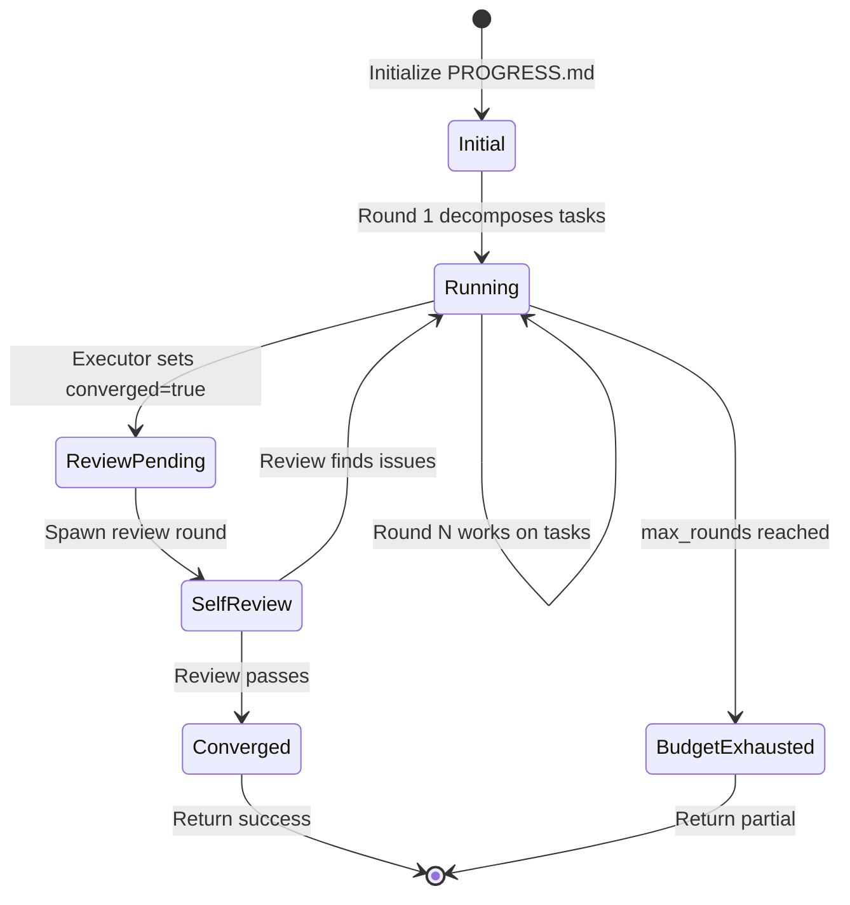
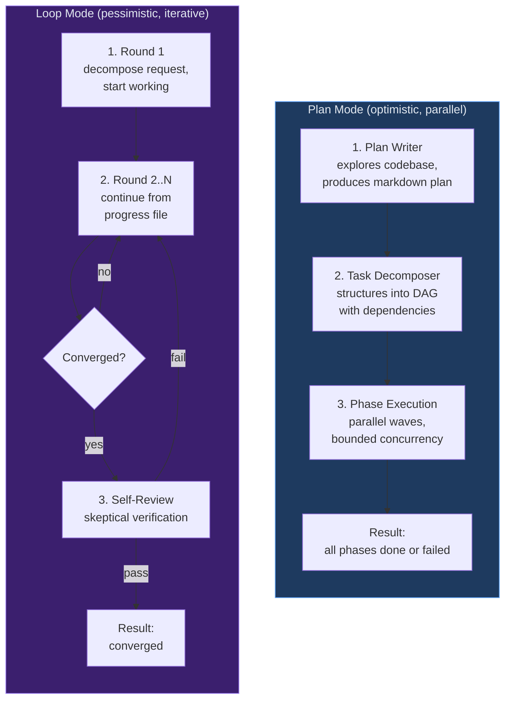

# Execution Modes

y-agent provides four execution modes that control how the system approaches a user's request. The GUI input area cycles through these modes: **Fast**, **Auto**, **Plan**, and **Loop**.

## Mode Overview

| Aspect | Fast | Plan | Loop |
|--------|------|------|------|
| Strategy | Direct single-turn | Decompose, then parallel DAG | Iterative convergence |
| Agent spawns | 0 (main agent only) | 3+ (writer, decomposer, N executors) | 2--25 (N rounds + review) |
| Task visibility | Upfront | All steps known before execution | Steps emerge during execution |
| Parallelism | None | Wave-based DAG (up to 4 concurrent) | Sequential rounds |
| Inter-step memory | Context window | Plan file + session transcripts | Progress file (YAML + markdown) |
| Feedback loop | None | None | Each round reads prior output |
| Self-review | None | None | Mandatory before convergence |
| Best for | Simple questions, single-file fixes | Multi-file refactors, known architecture | Research, quality refinement, unknown scope |

**Auto mode** uses a lightweight classifier agent to route requests to Fast, Plan, or Loop automatically.

---

## Mode Routing

When the user selects **Auto**, a classifier sub-agent (`complexity-classifier`) analyzes the request and returns one of three labels:



Classification rules:
- **plan** -- multi-file changes, architectural design, multi-step coordination where all steps are known upfront
- **loop** -- iterative refinement, research with unknown scope, quality through successive passes, exploration where the full set of steps cannot be determined in advance
- **fast** -- single-file fix, formatting, direct question, simple tweak

The classifier runs with `max_completion_tokens = 5` and `temperature = 0.0` for deterministic, low-latency routing.

---

## Plan Mode

Plan mode implements a three-stage pipeline: **plan** the work, **decompose** into a task DAG, then **execute** phases in dependency order with bounded parallelism.

### Sequence Diagram



```mermaid
sequenceDiagram
    participant U as User
    participant CS as ChatService
    participant MA as Main Agent
    participant PO as PlanOrchestrator
    participant PW as plan-writer
    participant TD as task-decomposer
    participant PE as plan-phase-executor

    U->>CS: Send message (plan mode)
    CS->>MA: execute turn (Plan tool injected)
    MA->>PO: Plan({request, context})

    rect rgb(30, 58, 95)
    Note over PO,PW: Stage 1: Plan Writing
    PO->>PW: SubAgent session<br/>tools: FileRead, Glob, Grep
    PW->>PW: Explore codebase (read-only)
    PW->>PW: Write plan as markdown
    PW-->>PO: Plan content
    PO->>PO: Persist plan to disk
    end

    rect rgb(30, 58, 95)
    Note over PO,TD: Stage 2: Task Decomposition
    PO->>TD: SubAgent session<br/>tools: none (JSON response only)
    TD->>TD: Decompose plan into<br/>structured tasks with<br/>phases and dependencies
    TD-->>PO: StructuredPlan JSON
    PO->>PO: Validate DAG, repair JSON
    end

    rect rgb(30, 58, 95)
    Note over PO,PE: Stage 3: Parallel Execution
    loop Each wave (dependency order)
        par Bounded parallelism (max 4)
            PO->>PE: Phase A (SubAgent)
            PO->>PE: Phase B (SubAgent)
            PO->>PE: Phase C (SubAgent)
        end
        PE-->>PO: Phase results
        PO->>PO: Update task statuses
    end
    end

    PO-->>MA: ToolOutput (completed/failed phases)
    MA-->>CS: Final response
    CS-->>U: Display result
```

### Stage Details

**Stage 1 -- Plan Writer** (`plan-writer` agent)
- Spawns a read-only sub-agent with `FileRead`, `Glob`, `Grep`
- Explores the codebase and produces a markdown plan
- Output persisted to `data/plan/<slug>.md`

**Stage 2 -- Task Decomposer** (`task-decomposer` agent)
- Zero-tool sub-agent with JSON schema enforcement
- Decomposes the plan into structured tasks with `id`, `phase`, `title`, `description`, `depends_on[]`, `key_files[]`, `acceptance_criteria[]`
- Includes automatic JSON repair for common LLM formatting issues

**Stage 3 -- Phase Execution** (N `plan-phase-executor` agents)
- Builds a DAG from task dependencies
- Executes in waves: each wave contains tasks whose dependencies are all complete
- Up to 4 tasks run concurrently within a wave (`futures::join_all`)
- Failed tasks cause all downstream dependents to be skipped
- Falls back to sequential execution if DAG validation fails (cycles, missing deps)

### DAG Execution Model



Tasks A and B execute in parallel (Wave 1). Once both complete, C and D execute in parallel (Wave 2). Finally E executes (Wave 3).

---

## Loop Mode

Loop mode implements an **iterative convergence** pattern: spawn fresh agent rounds, each reading a persistent progress file, working on remaining tasks, updating progress, and checking for convergence. A mandatory self-review round verifies completion before stopping.

### Sequence Diagram



```mermaid
sequenceDiagram
    participant U as User
    participant CS as ChatService
    participant MA as Main Agent
    participant LO as LoopOrchestrator
    participant LE as loop-executor
    participant PF as PROGRESS.md

    U->>CS: Send message (loop mode)
    CS->>MA: execute turn (Loop tool injected)
    MA->>LO: Loop({request, max_rounds})
    LO->>PF: Initialize progress file<br/>(YAML front matter + sections)

    rect rgb(59, 31, 110)
    Note over LO,PF: Round Loop (1..max_rounds)
    loop Each round (fresh context)
        LO->>PF: Read current state
        LO->>LE: SubAgent session<br/>(full toolset)
        LE->>PF: Read progress
        LE->>LE: Work on remaining tasks<br/>(FileRead, FileWrite,<br/>ShellExec, etc.)
        LE->>PF: Update progress file<br/>(tasks, insights, round log)
        LE-->>LO: Round complete
        LO->>PF: Parse front matter
        LO->>LO: Build RoundSummary

        alt converged == true
            Note over LO: Proceed to self-review
        else converged == false
            Note over LO: Continue to next round
        end
    end
    end

    rect rgb(80, 40, 20)
    Note over LO,PF: Self-Review Round
    LO->>LE: Review SubAgent session
    LE->>PF: Critically review all [DONE] tasks
    alt Issues found
        LE->>PF: Set converged: false<br/>Add new [TODO] tasks
        LE-->>LO: Review failed
        Note over LO: Resume round loop
    else All verified
        LE->>PF: Keep converged: true
        LE-->>LO: Review passed
    end
    end

    LO-->>MA: ToolOutput (converged / budget_exhausted)
    MA-->>CS: Final response
    CS-->>U: Display result
```

### Round Lifecycle

Each round follows a strict 5-step protocol:

1. **READ** -- The executor receives the full progress file content as its input message. It understands the Original Request, current task states, and insights from prior rounds.

2. **DECOMPOSE** (round 1 only) -- If `status: initial`, the executor breaks the request into concrete `[TODO]` tasks and sets `status: running`.

3. **WORK** -- The executor picks the highest-priority remaining tasks and produces concrete outputs using its full toolset (`FileRead`, `FileWrite`, `ShellExec`, `WebFetch`, `Browser`, `Glob`, `Grep`).

4. **UPDATE** -- The executor writes the updated progress file: moves completed tasks to `[DONE]`, updates `[IN PROGRESS]`, adds insights, appends a round log entry, increments `total_rounds`.

5. **CONVERGENCE** -- When all tasks are `[DONE]`, the executor performs a strict self-check. Only if truly satisfied does it set `converged: true` in the front matter.

### Progress File Format

The progress file (`data/loop/<slug>/PROGRESS.md`) is the sole inter-round memory. Each round's sub-agent starts with a fresh context window -- the progress file is how information persists.

**YAML front matter:**

```yaml
---
title: "Task description"
status: initial | running | converged | budget_exhausted
total_rounds: 0
max_rounds: 10
converged: false
created_at: "2026-05-11T12:00:00Z"
updated_at: "2026-05-11T12:00:00Z"
---
```

**Document sections:**

```markdown
## Original Request
(immutable -- never modified by the executor)

## Tasks
### [DONE] Task name
- Summary of work done, key decisions, files changed

### [IN PROGRESS] Task name
- Current status notes

### [TODO] Task name

## Insights
(concise lessons learned, useful for future rounds)

## Round Log
### Round 1
- Completed: ...
- Remaining: ...
```

The orchestrator parses task headings (`### [DONE]`, `### [IN PROGRESS]`, `### [TODO]`) to track progress. The `converged` front matter field is the sole termination signal.

### Self-Review Mechanism

When the executor sets `converged: true`, the orchestrator spawns one additional sub-agent round with a skeptical review prompt:

- Verify each `[DONE]` task is truly complete and correct
- Check the original request is fully satisfied
- If issues are found: revert `converged` to `false`, add new `[TODO]` tasks
- If everything passes: keep `converged: true`

This prevents premature convergence from optimistic agents declaring tasks "done" without thorough verification.

### Convergence State Machine



---

## Comparative View

The following diagram shows how the same complex task flows through Plan mode versus Loop mode:



**Plan mode** is optimistic: it assumes the full scope is knowable upfront, decomposes everything before executing, and exploits parallelism. Best when the task structure is clear.

**Loop mode** is pessimistic: it assumes scope will emerge during execution, each round discovers new work, and quality improves through iteration. Best when the end state is uncertain.

---

## Decision Guide

Choose **Plan mode** when:
- The task involves multiple files with clear, known dependencies
- All steps can be enumerated upfront
- Parallelism provides a meaningful speedup
- Examples: multi-file refactor, adding a new feature across layers, migration with known schema changes

Choose **Loop mode** when:
- The full scope is not clear upfront
- Quality benefits from multiple passes
- The task is exploratory or research-oriented
- Each iteration may reveal new requirements
- Examples: thorough code review, iterative research, complex debugging, quality-focused document writing

Choose **Fast mode** when:
- The task is a single-file fix, direct question, or simple tweak
- No orchestration overhead is warranted

Choose **Auto mode** to let the classifier decide. The classifier runs in under 1 second with near-zero token cost (5 max completion tokens).

---

## Implementation Reference

| Component | File | Purpose |
|-----------|------|---------|
| Plan signal tool | `crates/y-tools/src/builtin/plan.rs` | Validates Plan tool input |
| Plan orchestrator | `crates/y-service/src/plan_orchestrator.rs` | 3-stage pipeline execution |
| Plan writer agent | `config/agents/plan-writer.toml` | Read-only codebase exploration |
| Task decomposer agent | `config/agents/plan-task-decomposer.toml` | Structured JSON task output |
| Plan phase executor agent | `config/agents/plan-phase-executor.toml` | Per-phase implementation |
| Loop signal tool | `crates/y-tools/src/builtin/loop_tool.rs` | Validates Loop tool input |
| Loop orchestrator | `crates/y-service/src/loop_orchestrator.rs` | Round loop + convergence |
| Loop executor agent | `config/agents/loop-executor.toml` | Per-round execution |
| Complexity classifier | `config/agents/complexity-classifier.toml` | Auto mode 3-way routing |
| Mode routing | `crates/y-service/src/chat.rs` | Config flag management |
| Tool dispatch intercept | `crates/y-service/src/agent_service/tool_dispatch.rs` | Plan/Loop tool interception |
