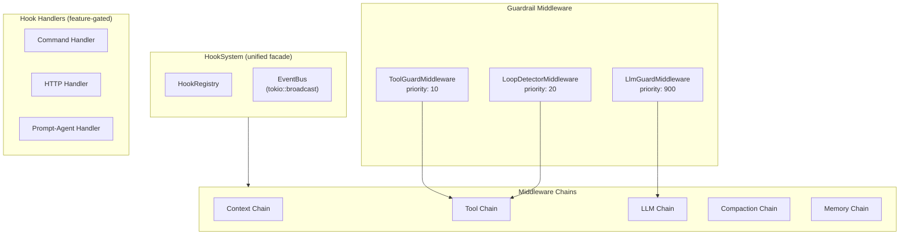
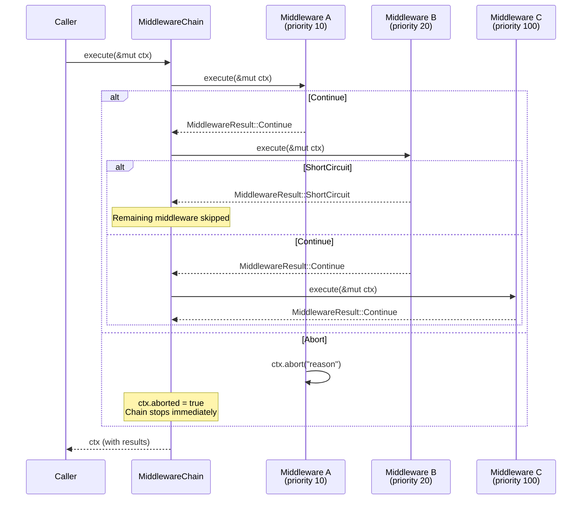
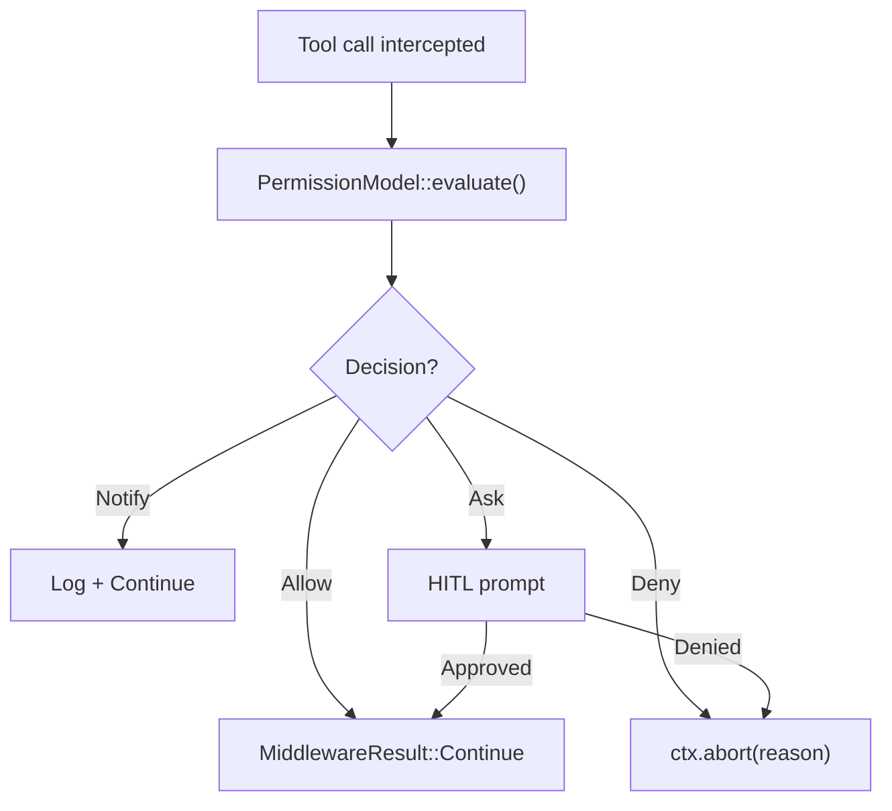
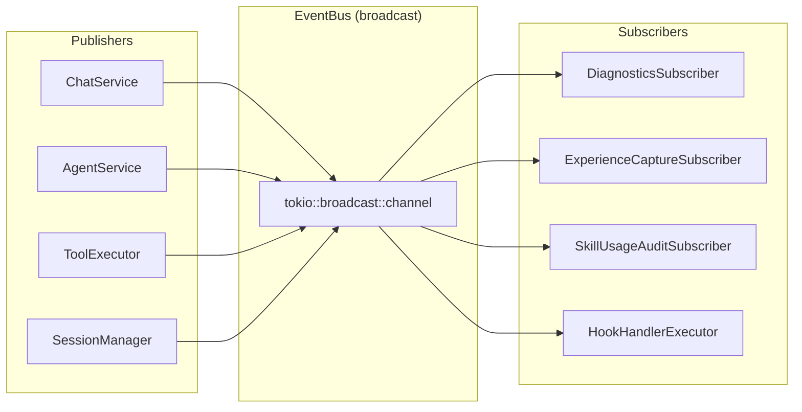
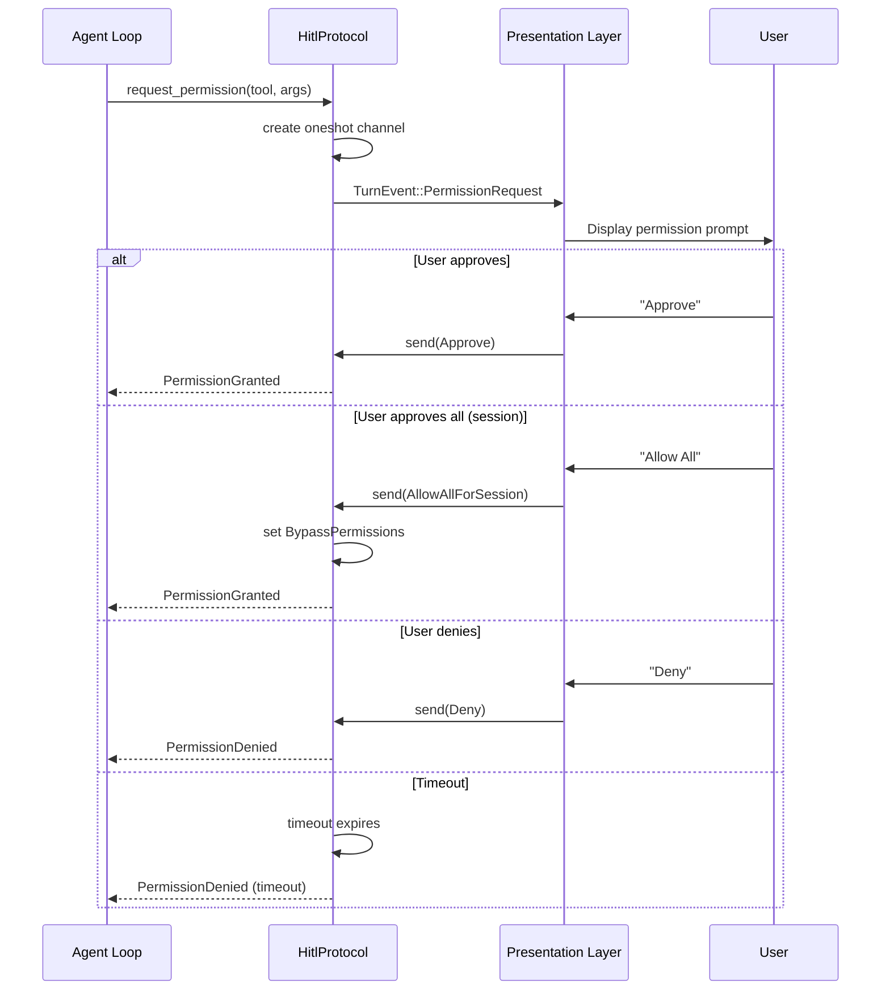

# Middleware & Hooks

The middleware system provides a uniform interception layer for all operations in y-agent. Guardrails, event handling, and HITL protocols are all implemented as middleware.

## Architecture



## Middleware Chain Execution

**Entry:** `MiddlewareChain::execute()` in `y-hooks/src/chain.rs`



### Execution Rules

1. Middleware entries sorted by `(priority, insertion_order)` -- lower priority number executes first
2. Equal priorities preserve insertion order (stable sort)
3. `ctx.aborted = true` stops the chain immediately
4. `MiddlewareResult::ShortCircuit` skips remaining middleware
5. Errors propagate upward (stop the chain)
6. Duplicate middleware names are rejected at registration time

### MiddlewareContext

```
MiddlewareContext {
    chain_type: ChainType,        // Context | Tool | Llm | Compaction | Memory
    payload: serde_json::Value,   // chain-specific data
    metadata: serde_json::Value,  // additional context
    aborted: bool,                // set by middleware to stop execution
    abort_reason: Option<String>, // human-readable reason for abort
}
```

### Chain Types

| Chain | When Executed | Payload |
|-------|-------------|---------|
| `Context` | During context assembly | Context items, token counts |
| `Tool` | Before/after tool execution | `{tool_name, arguments, phase}` |
| `Llm` | Before/after LLM calls | Request/response data |
| `Compaction` | During context compaction | Compaction parameters |
| `Memory` | During memory operations | Memory read/write data |

## Guardrail Middleware

### ToolGuardMiddleware (priority 10)

Intercepts tool calls for permission enforcement:



### LoopDetectorMiddleware (priority 20)

Detects 4 types of loop patterns:

| Pattern | Detection | Example |
|---------|-----------|---------|
| **Repetition** | Same tool + same arguments N times | `FileRead("/a")` called 5 times |
| **Oscillation** | Alternating between two states | Write A -> Undo A -> Write A -> Undo A |
| **Drift** | Incremental changes without progress | Temperature 0.1 -> 0.2 -> 0.3 -> ... |
| **Redundant** | Tool call whose result was already obtained | Re-searching after results were used |

When a loop is detected, the middleware can:
- Inject a warning message into the context (soft intervention)
- Abort the tool chain (hard intervention, based on severity)

### LlmGuardMiddleware (priority 900)

Post-LLM output validation (highest priority = runs last in the chain):
- Content filter checks
- Structural validation of tool calls
- Response format compliance

### Additional Guardrail Components

| Component | Responsibility |
|-----------|---------------|
| `PermissionModel` | 4-level evaluation: allow / notify / ask / deny |
| `TaintTracker` | Tracks data flow taint through tool results |
| `RiskScorer` | Composite risk score from multiple signals |
| `HitlProtocol` | Human-in-the-loop with configurable timeout |
| `HitlHandler` | Manages the HITL interaction flow |
| `StructuralValidator` | Validates tool call structure against schemas |
| `CapabilityGapMiddleware` | Detects when agent lacks required capabilities |
| `GuardrailManager` | Hot-reloadable config via `RwLock<GuardrailConfig>` |

## Event Bus

**Component:** `EventBus` in `y-hooks/src/lib.rs`

The event bus uses `tokio::broadcast` channels for async event distribution:



### Event Types

Events correspond to the 24 `HookPoint` variants defined in y-core:

| HookPoint | When Emitted |
|-----------|-------------|
| `PreLlmCall` | Before sending request to LLM |
| `PostLlmCall` | After receiving LLM response |
| `PreToolExecute` | Before executing a tool |
| `PostToolExecute` | After tool execution completes |
| `SessionCreated` | New session created |
| `SessionForked` | Session forked/branched |
| `ToolGapDetected` | Agent requested unavailable tool |
| `DynamicAgentCreated` | Agent created at runtime |
| `ContextOverflow` | Context window exhausted |
| `PostSkillInjection` | Skills injected into context |
| `CompactionTriggered` | Context compaction started |
| ... | (24 total hook points) |

## HITL (Human-in-the-Loop) Protocol



### Two HITL Entry Points

1. **Permission requests**: When `PermissionModel` returns `Ask` for a tool call
2. **AskUser tool**: When the agent explicitly requests user input

Both use `oneshot::channel()` inserted into the `ToolExecContext`'s pending maps. The presentation layer is responsible for rendering the prompt and sending the response.

## Hook Handlers (Feature-Gated)

When the `hook_handler` feature is enabled, hook events can trigger automated responses:

| Handler | Trigger | Action |
|---------|---------|--------|
| `CommandHandler` | Hook event matches pattern | Execute shell command |
| `HttpHandler` | Hook event matches pattern | Send HTTP request |
| `PromptAgentHandler` | Hook event matches pattern | Delegate to an agent |

Each handler returns a `HookDecision` that can modify the ongoing operation or allow it to proceed unchanged.

## Integration Points

### Tool Execution Integration

In `ToolExecutor::execute()`:

```
Pre-execution:
  payload = { tool_name, arguments, phase: "pre" }
  -> if ctx.aborted: return ToolRegistryError::ExecutionError

[tool.execute()]

Post-execution:
  payload = { tool_name, result: output.content, phase: "post" }
  -> failures only logged, never propagated
```

### GuardrailManager Hot-Reload

`GuardrailManager` wraps its config in `RwLock<GuardrailConfig>`, enabling runtime config changes without restart:

```rust
guardrail_manager.update_config(new_config); // takes write lock, swaps config
```

All middleware reads the config via read locks, so updates take effect on the next middleware execution.
