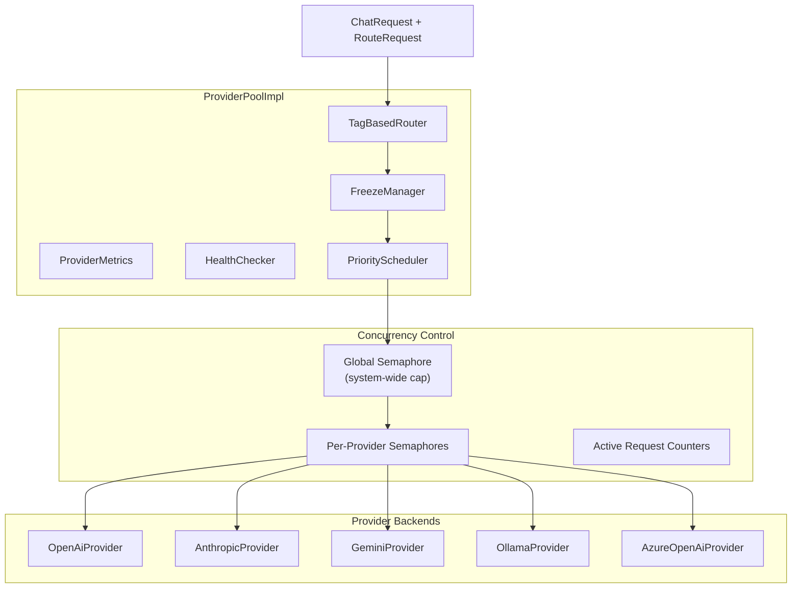
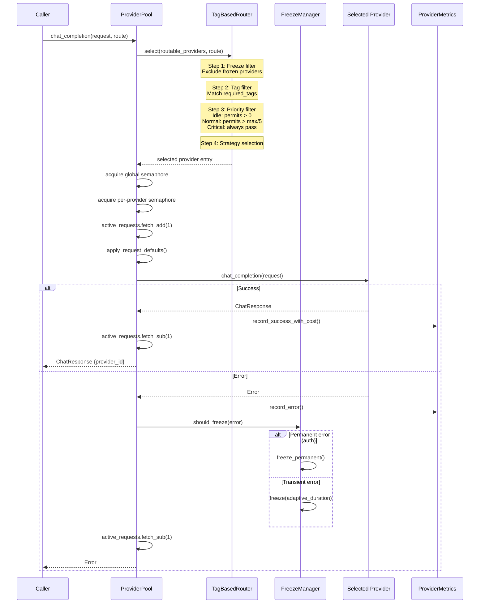
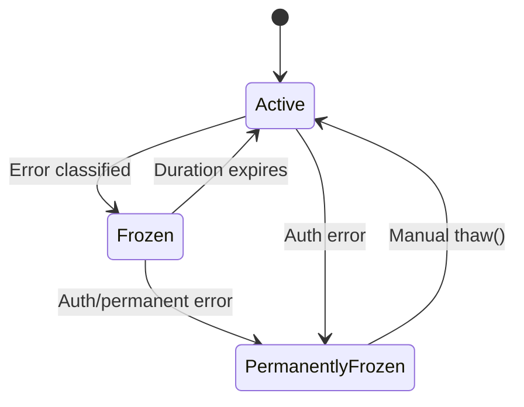
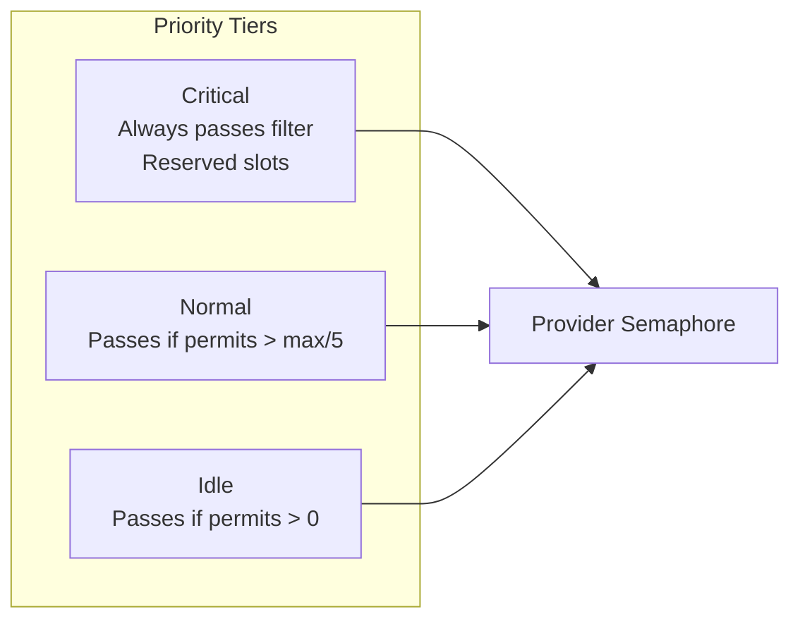
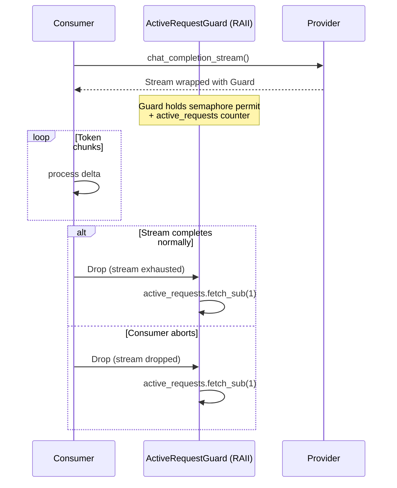

# Provider Pool

The provider pool manages multiple LLM providers with tag-based routing, adaptive freeze/thaw failover, priority scheduling, and concurrency control.

## Architecture



## Routing Flow

**Entry:** `ProviderPoolImpl::chat_completion()` in `y-provider/src/pool.rs`



### Route Selection Strategy

The `TagBasedRouter` supports 5 selection strategies for choosing among eligible providers:

| Strategy | Algorithm | Best For |
|----------|-----------|----------|
| `Priority` (default) | First candidate in sorted order | Predictable provider preference |
| `Random` | Time-seeded random selection | Load distribution |
| `LeastLoaded` | Most available semaphore permits | Balanced utilization |
| `RoundRobin` | Atomic counter modulo candidates | Even distribution |
| `CostOptimized` | Minimum `cost_per_1k_input` | Cost minimization |

### RouteRequest

```
RouteRequest {
    preferred_provider_id: Option<ProviderId>,  // exact provider match
    preferred_model: Option<String>,            // preferred model name
    required_tags: Vec<String>,                 // all must match
    priority: Priority,                         // Critical | Normal | Idle
    strategy: Option<RoutingStrategy>,          // override default strategy
}
```

## Freeze/Thaw Failover



### Error Classification

The `error_classifier` categorizes provider errors into `StandardError` types:

| Error Type | Freeze Duration | Permanent |
|-----------|----------------|-----------|
| `Quota` | 60s, escalating | No |
| `RateLimit` | 30s, escalating | No |
| `Network` | 15s | No |
| `ServerError` | 30s | No |
| `Authentication` | -- | Yes |
| `InvalidRequest` | -- | No (not frozen) |
| `Unknown` | 15s | No |

**Adaptive duration:** Consecutive failures increase freeze duration. The formula scales based on the number of consecutive errors, up to a configurable maximum.

### Freeze/Thaw API

```rust
// Programmatic freeze/thaw
pool.freeze(provider_id, duration);
pool.thaw(provider_id);

// Query status
pool.provider_statuses(); // -> Vec<ProviderStatus>
```

## Priority Scheduling

Three priority tiers with reserved capacity:



| Tier | Filter Rule | Use Case |
|------|------------|----------|
| `Critical` | Always passes, reserved slots guaranteed | User-facing requests, error recovery |
| `Normal` | Passes if available permits > max_permits / 5 | Standard agent operations |
| `Idle` | Passes if any permits available | Background tasks, prefetch, analytics |

## Concurrency Control

Two-level semaphore system:

```
Global Semaphore (optional)
  |
  +-- Provider A Semaphore (max_concurrent per provider)
  |     +-- Active Request Counter (atomic)
  |
  +-- Provider B Semaphore
  |     +-- Active Request Counter
  |
  +-- Provider C Semaphore
        +-- Active Request Counter
```

- **Global semaphore**: System-wide concurrency cap across all providers
- **Per-provider semaphore**: Limits concurrent requests to each individual provider
- **Active request counter**: `AtomicUsize` for real-time monitoring (no lock overhead)

### Streaming Guard

For streaming responses, the concurrency counter must be decremented when the stream ends, not when the initial response arrives:



The `ActiveRequestGuard` implements `Drop` to ensure cleanup even on abnormal stream termination.

## Provider Configuration

```toml
[[providers]]
id = "anthropic-main"
provider_type = "anthropic"
api_key = "${ANTHROPIC_API_KEY}"
model = "claude-sonnet-4-6"
tags = ["fast", "coding"]
max_concurrent = 10
priority = 1

[providers.defaults]
temperature = 0.7
max_tokens = 4096

[providers.proxy]
url = "http://proxy.internal:8080"
```

### Supported Provider Types

| Type String | Provider | Notes |
|-------------|----------|-------|
| `openai` | `OpenAiProvider` | Standard OpenAI API |
| `openai-compat` / `openai_compatible` / `custom` | `OpenAiProvider` | OpenAI-compatible APIs |
| `anthropic` | `AnthropicProvider` | Anthropic Claude API |
| `gemini` | `GeminiProvider` | Google Gemini API |
| `ollama` | `OllamaProvider` | Local Ollama inference |
| `azure` | `AzureOpenAiProvider` | Azure OpenAI deployments |
| `deepseek` | `OpenAiProvider` | DeepSeek API (OpenAI-compatible) |

### Multi-Level Proxy Config

Proxy configuration follows a precedence chain: provider-level > tag-level > global.

## Metrics & Observability

`ProviderMetrics` tracks per-provider:

| Metric | Type |
|--------|------|
| Request count | Counter |
| Success count | Counter |
| Error count | Counter |
| Latency | Histogram |
| Token usage (input/output) | Counter |
| Cost (USD) | Counter |
| Consecutive failures | Gauge |
| Current active requests | Gauge |

Metrics are persisted to `SqliteProviderMetricsStore` for historical analysis and exposed via `ObservabilityService::provider_snapshots()`.

## Cost Limits

Providers support automatic freeze on budget exhaustion:

```toml
[providers.cost_limit]
daily_max_usd = 50.0
monthly_max_usd = 500.0
action = "freeze"  # freeze | warn | deny
```

When a cost limit is reached, the provider is frozen until the limit resets (daily at midnight UTC, monthly on the 1st). The `CostService` in y-service aggregates costs and generates daily summaries.
