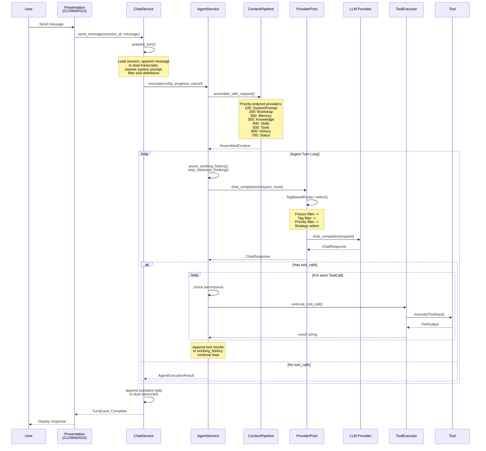
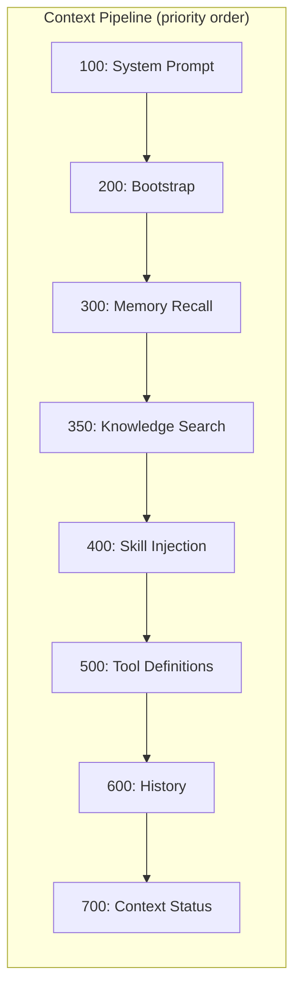
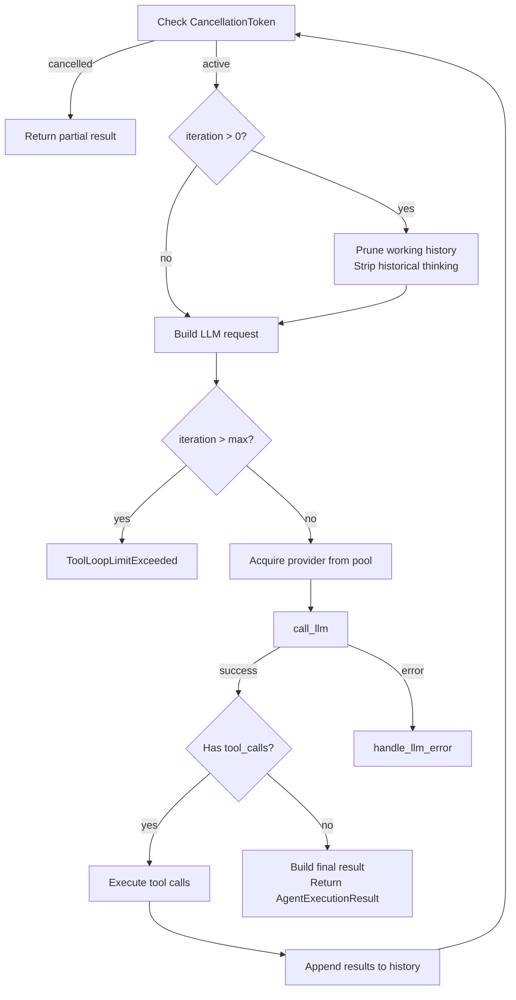
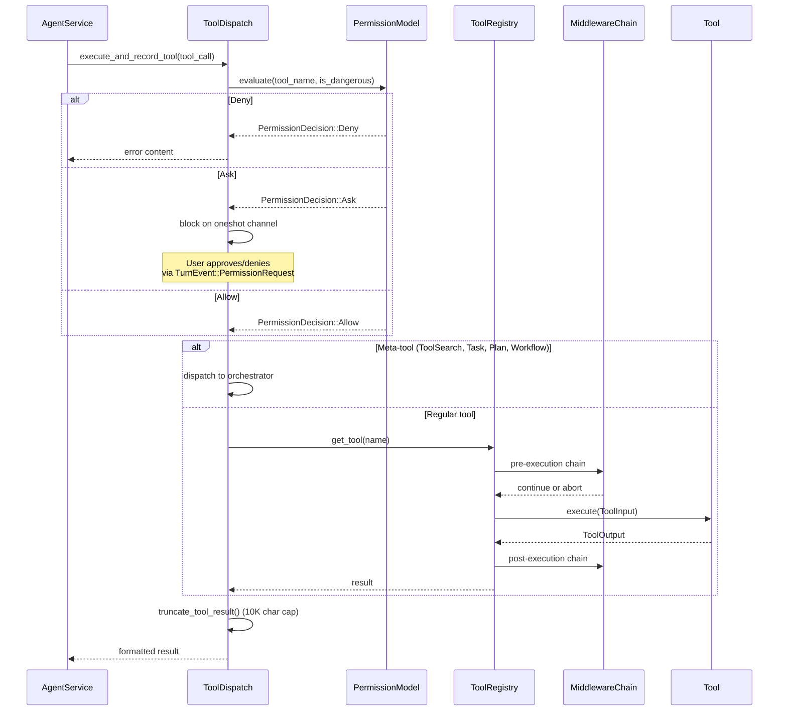
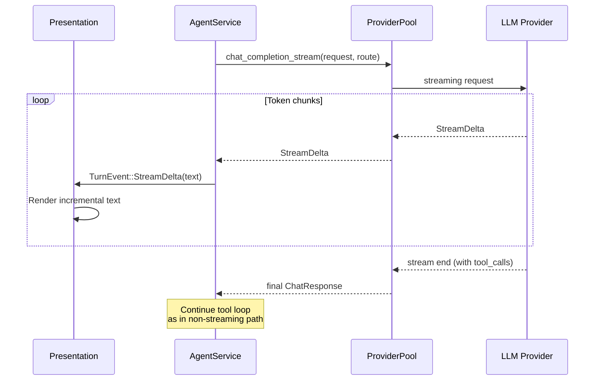

# Request Lifecycle

This document traces the end-to-end journey of a user message through the y-agent system, from input to response.

## High-Level Flow

## Phase 1: Turn Preparation

**Entry:** `ChatService::send_message()` in `y-service/src/chat.rs`

1. **Load session** from `SessionManager` using `session_id`
2. **Append user message** to both transcripts:
   - Context transcript (LLM-facing, subject to compaction)
   - Display transcript (UI-facing, immutable)
3. **Resolve system prompt** from `PromptContext` (rendered template with mode overlays)
4. **Load conversation history** from the context transcript
5. **Filter tool definitions** via `AgentService::filter_tool_definitions()` -- respects agent `allowed_tools` allowlist
6. **Build `AgentExecutionConfig`** with session_id, messages, system_prompt, tool_definitions, max_iterations, trust_tier

## Phase 2: Context Assembly

**Entry:** `ContextPipeline::assemble_with_request()` in `y-context/src/pipeline.rs`

The pipeline iterates registered `ContextProvider` implementations in priority order. Each provider appends `ContextItem` entries to the `AssembledContext`.

Each `ContextItem` carries:
- `category` -- SystemPrompt, Bootstrap, Memory, Knowledge, Skills, Tools, History, Status
- `content` -- the actual text injected into the prompt
- `token_estimate` -- estimated token count for budget tracking
- `priority` -- ordering weight within the category

**Fail-open design:** If any provider errors, the pipeline logs a warning and continues. Partial context is better than no context.

## Phase 3: Agent Execution Loop

**Entry:** `AgentService::execute()` in `y-service/src/agent_service/mod.rs`

### Initialization

1. Set up `DiagnosticsContext` and trace scope (if tracing enabled)
2. Build `working_history` from assembled context + conversation messages
3. Initialize `ToolExecContext` with iteration counters, token accumulators, cancellation token

### Loop Body (each iteration)

### Intra-Turn Pruning

Between iterations, the system applies three pruning strategies:

1. **`IntraTurnPruner::prune_working_history()`** -- removes failed tool call branches (error results that the LLM has already seen and reacted to)
2. **`pruning::prune_old_tool_results()`** -- truncates or removes stale tool outputs from earlier iterations
3. **`pruning::strip_historical_thinking()`** -- removes `reasoning_content` from previous turns (only the current turn's thinking is preserved)

## Phase 4: LLM Communication

**Entry:** `llm::call_llm()` in `y-service/src/agent_service/llm.rs`

1. Build `ChatRequest` with model, temperature, max_tokens, tools, thinking config
2. Build `RouteRequest` with preferred provider/model, required tags, priority tier
3. Provider pool selects a provider via `TagBasedRouter` (see [Provider Pool](./provider-pool))
4. Call `provider.chat_completion()` or `chat_completion_stream()`
5. On success: accumulate `TokenUsage` into cumulative counters
6. On error: provider pool classifies error and may freeze the provider

## Phase 5: Tool Execution

**Entry:** `tool_handling::handle_native_tool_calls()` in `y-service/src/agent_service/tool_handling.rs`

### Meta-Tool Interception

Before reaching the registry, certain tool names are intercepted and dispatched to specialized orchestrators:

| Tool Name | Orchestrator | Purpose |
|-----------|-------------|---------|
| `ToolSearch` | `ToolSearchOrchestrator` | Activates tools into the LRU set |
| `Task` | `TaskDelegationOrchestrator` | Spawns sub-agent with isolated session |
| `Plan` | `PlanOrchestrator` | Structured planning via agent delegation |
| `WorkflowCreate/List/...` | `WorkflowOrchestrator` | DAG workflow CRUD |
| `ScheduleCreate/List/...` | `WorkflowOrchestrator` | Schedule management |

### Permission Model

The permission check follows a layered evaluation:

1. `PermissionModel::evaluate(tool_name, is_dangerous)` -- config-based rules (allow/notify/ask/deny)
2. `session_permission_mode()` -- session-level override (`BypassPermissions` converts Ask -> Allow, but never overrides Deny)
3. **Built-in trust auto-allow**: if `trust_tier == BuiltIn && agent_allowed_tools.contains(name)` -> Allow

## Phase 6: Response Delivery

After the loop exits (no tool calls in the LLM response):

1. `build_final_result()` constructs `AgentExecutionResult` with:
   - `content` -- the assistant's text response
   - `new_messages` -- all messages generated during the turn (assistant + tool results)
   - `cumulative_usage` -- total token counts across all iterations
   - `cumulative_cost` -- total cost in USD
   - `iterations` -- number of loop iterations
2. `ChatService` appends the assistant reply to dual transcripts
3. Emits `TurnEvent::Complete` through the progress channel
4. Presentation layer renders the response to the user

## Streaming Flow

For streaming responses, the flow differs at Phase 4:

The provider pool wraps the stream with an `ActiveRequestGuard` (RAII) to ensure the per-provider concurrency counter is decremented even if the consumer aborts mid-stream.

## HITL (Human-in-the-Loop) Interrupts

Two types of HITL interrupts can pause the turn loop:

### Permission Request
When a tool requires user approval (`PermissionDecision::Ask`):
1. A `oneshot::channel()` is created
2. The `Sender` is inserted into `ctx.pending_permissions`
3. `TurnEvent::PermissionRequest` is emitted to the presentation layer
4. Execution blocks on `receiver.await`
5. User responds with Approve / AllowAllForSession / Deny

### AskUser Tool
When the agent invokes the `AskUser` tool:
1. The tool output is delivered to the user
2. A `oneshot::channel()` is inserted into `ctx.pending_interactions`
3. Execution blocks until the user provides a response
4. The response becomes the tool result, and the loop continues

## Error Recovery

| Error Type | Behavior |
|-----------|----------|
| LLM quota/rate-limit | Provider frozen, pool retries with next available provider |
| LLM auth error | Provider frozen permanently |
| Tool execution error | Error string returned as tool result, LLM sees it and adapts |
| Tool loop limit exceeded | Turn ends with `ToolLoopLimitExceeded`, partial results preserved |
| Cancellation | Turn ends with `Cancelled`, partial results and messages preserved |
| Context overflow | `ContextWindowGuard` triggers compaction or pruning |
