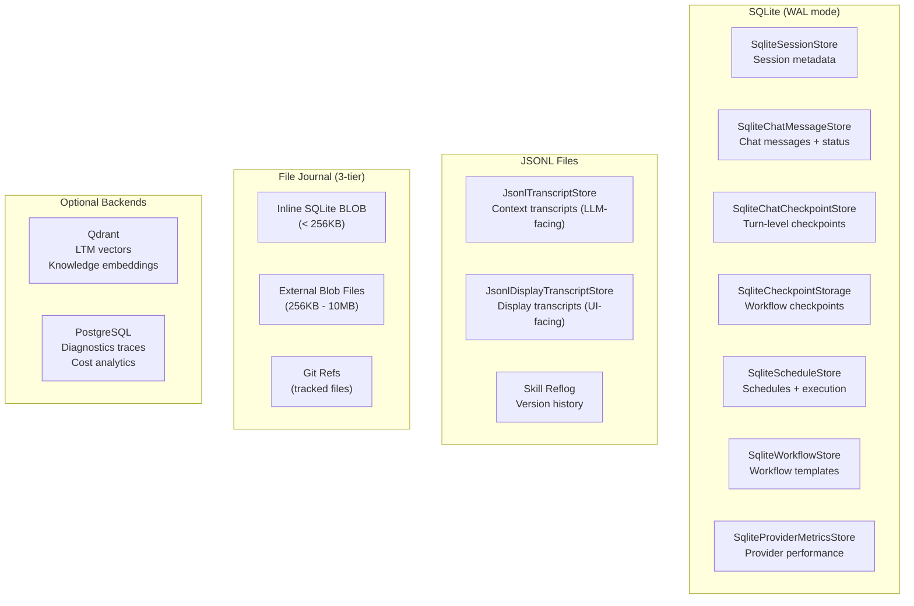
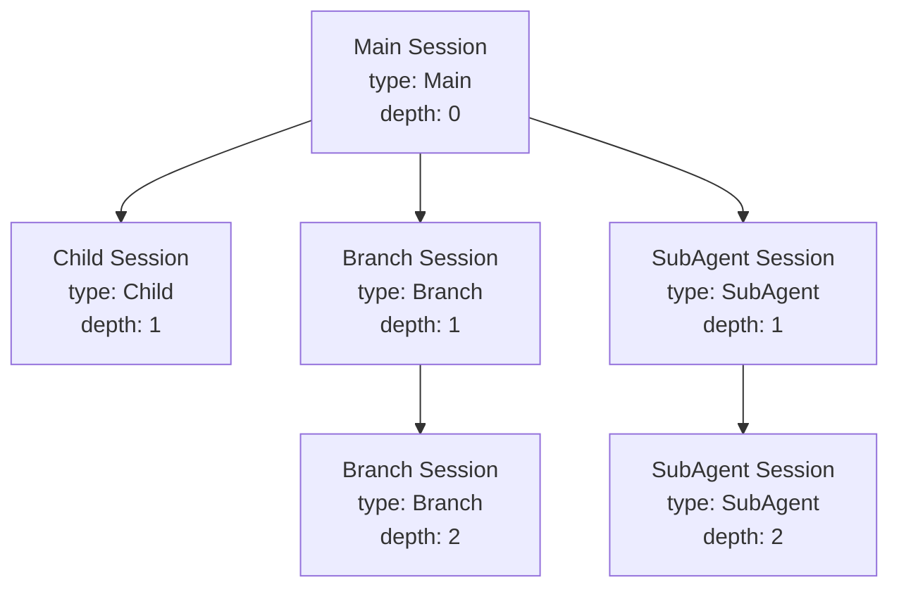
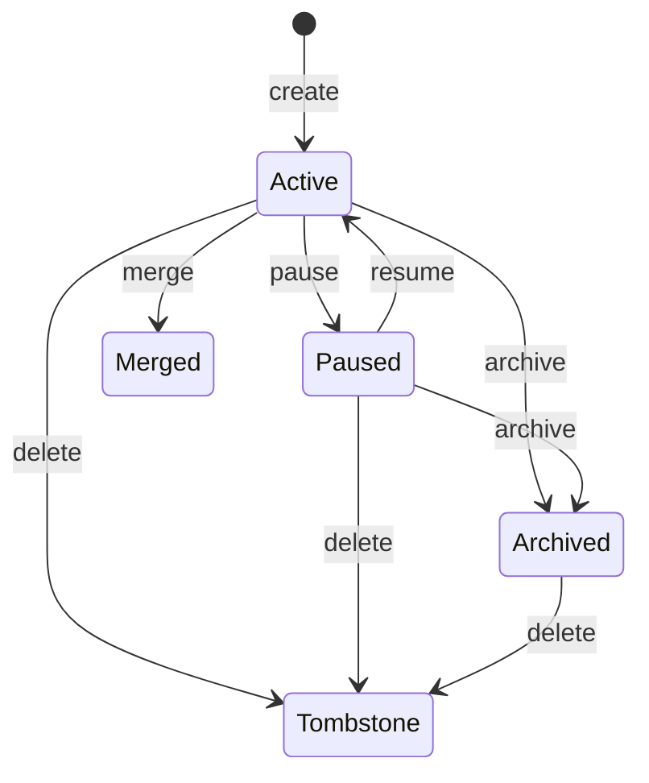
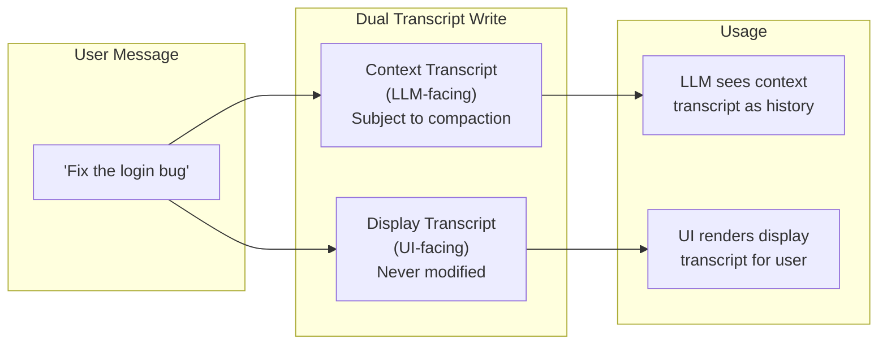
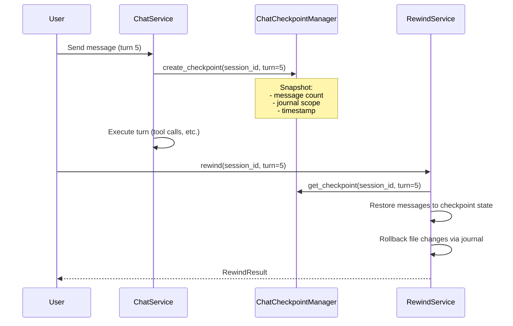
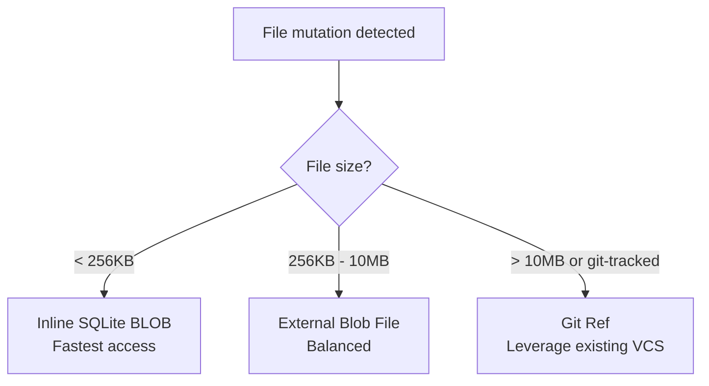
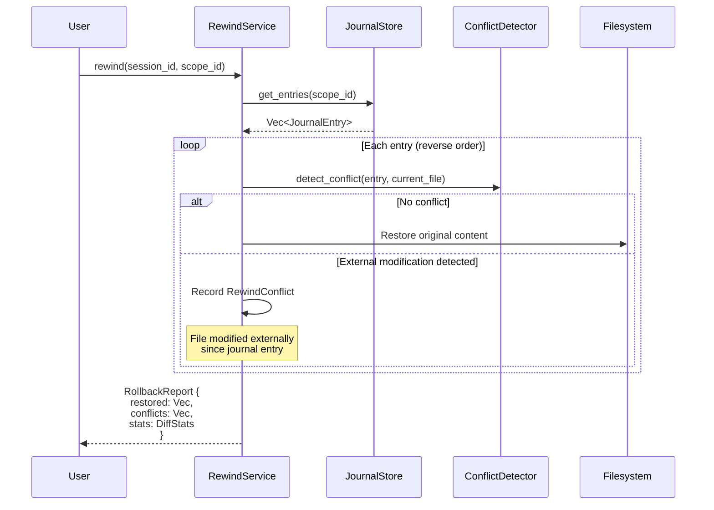
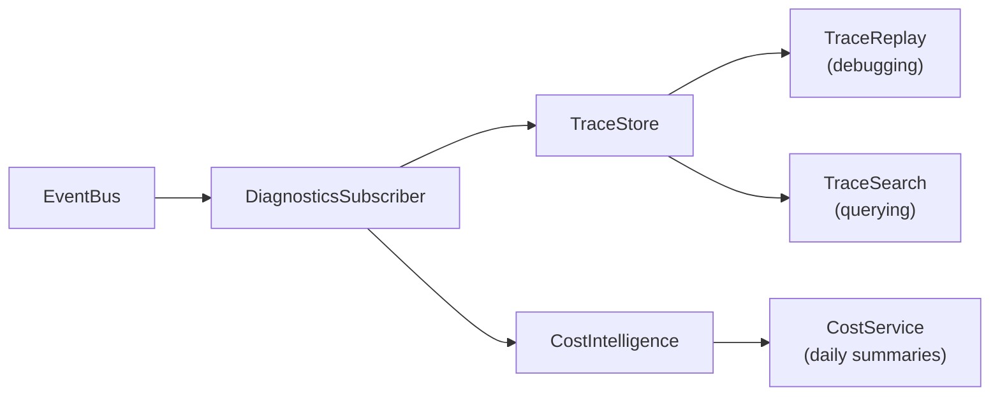

# Storage & Sessions

y-agent uses a multi-backend storage architecture: SQLite (WAL mode) for operational state, JSONL files for transcripts, Qdrant for vectors, and PostgreSQL for analytics.

## Storage Architecture



### Connection Pool

`create_pool()` in `y-storage/src/lib.rs` creates a `sqlx::SqlitePool` configured for WAL mode:

- Write-Ahead Logging for concurrent read/write
- Connection pooling via sqlx
- Embedded migrations via `run_embedded_migrations()`
- Database files stored in `data/` directory

## Session Management

### Session Tree

Sessions form a tree structure supporting branching and sub-agent isolation:



### Session Types

| Type | Purpose | Created By |
|------|---------|-----------|
| `Main` | Top-level user session | `SessionManager::create_session()` |
| `Child` | Child of a main session | Explicit child creation |
| `Branch` | Fork of an existing session | `SessionManager::fork_session()` |
| `Ephemeral` | Temporary session (no persistence) | Internal operations |
| `SubAgent` | Isolated session for delegated agents | `TaskDelegationOrchestrator` |
| `Canonical` | Canonical version of a session | `CanonicalSessionManager` |

### Session State Machine



### Session Lifecycle

**Creation:**
1. Allocate `SessionId` (UUID-based string)
2. Write `Session` record to SQLite
3. Create two transcript records: Context (LLM-facing) and Display (UI-facing)

**Message Append (dual-transcript write):**
1. Write message to context transcript (used as LLM conversation history)
2. Write message to display transcript (used for UI rendering)
3. Both writes are atomic SQLite inserts

**Forking:**
1. Copy parent's context transcript up to specified message index
2. Create new `Session` with `parent_id = original`, `depth = parent.depth + 1`
3. Fork shares no live state with parent -- independent branch
4. Depth limit enforced to prevent unbounded nesting

**Sub-Agent Branching:**
1. Create child session linked to parent `session_id`
2. Child inherits `knowledge_collections` and `trust_tier`
3. Isolated message history -- no parent history visible
4. Used by `TaskDelegationOrchestrator` for delegation

## Dual Transcript System



### Why Two Transcripts?

| Aspect | Context Transcript | Display Transcript |
|--------|-------------------|-------------------|
| Purpose | LLM conversation history | User-visible conversation |
| Compaction | Subject to summarization | Never modified |
| Content | May be summarized/pruned | Full original messages |
| Backend | JSONL (`JsonlTranscriptStore`) | JSONL (`JsonlDisplayTranscriptStore`) |
| Read By | Context pipeline (History stage) | Presentation layer |

When context compaction triggers:
1. Context transcript is replaced with a summary message
2. Display transcript remains untouched
3. User sees full conversation history in the UI
4. LLM works with compressed history to stay within context limits

## Chat Checkpoints

Turn-level checkpointing enables conversation rewind:



### ChatCheckpoint Structure

```
ChatCheckpoint {
    checkpoint_id: String,
    session_id: SessionId,
    turn_number: u32,
    message_count_before: u32,     // messages at checkpoint time
    journal_scope_id: Option<Uuid>, // linked file journal scope
    invalidated: bool,              // true if checkpoint is no longer valid
}
```

## File Journal

The file journal tracks all file mutations made by tools, enabling rollback:

### Three-Tier Storage



### Journal Components

| Component | Responsibility |
|-----------|---------------|
| `FileJournalMiddleware` | Intercepts FileWrite/FileCreate/FileDelete/FileMove tool calls |
| `JournalStore` | Persists file snapshots with three-tier strategy |
| `JournalScope` | Groups related file changes (per-turn or per-task) |
| `FileHistoryManager` | Creates per-session file backups at user message boundaries |
| `ConflictDetector` | Detects external file modifications between journal entries |

### Rollback Flow



### JournalEntry

```
JournalEntry {
    entry_id: Uuid,
    scope_id: Uuid,
    file_path: PathBuf,
    operation: FileOperation,    // Create | Write | Delete | Move
    original_content: Option<Vec<u8>>,
    original_hash: Option<String>,
    timestamp: DateTime<Utc>,
    storage_strategy: StorageStrategy,
}
```

## Diagnostics Storage

### Trace Store

Two backends behind the `TraceStore` trait:

| Backend | Use Case | Storage |
|---------|----------|---------|
| `SqliteTraceStore` | Production | SQLite (default) or PostgreSQL |
| `InMemoryTraceStore` | Testing | In-memory `HashMap` |

### DiagnosticsSubscriber

Listens on the event bus and captures runtime observations:



Captured data per trace:
- Session ID, agent name, trace ID
- All LLM requests and responses (with raw payloads)
- Tool calls and results
- Token usage and cost
- Timing information
- Error details

## Migration System

SQLite migrations are stored in `migrations/sqlite/` and embedded into the binary:

```
migrations/sqlite/
  001_initial.sql
  002_add_schedules.sql
  003_add_workflows.sql
  ...
```

`run_embedded_migrations()` applies pending migrations on startup. This ensures the database schema is always up to date without external migration tooling.
