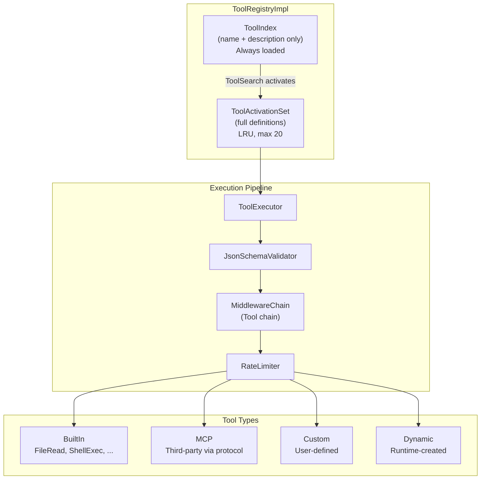
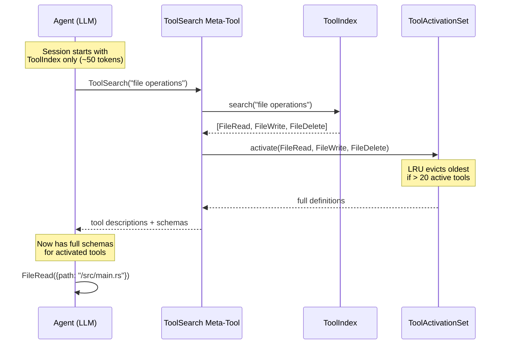
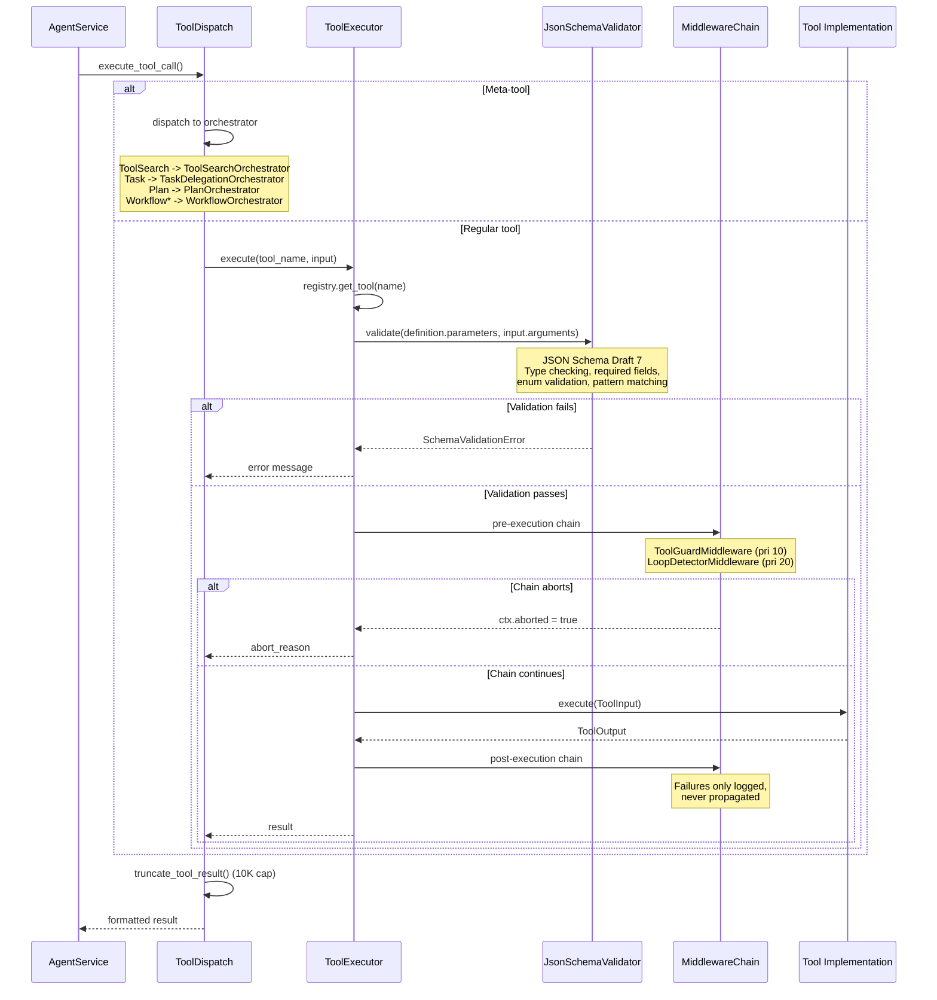
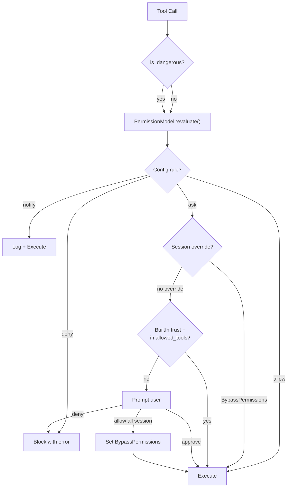

# Tool System

The tool system provides a type-safe, permission-aware, token-efficient framework for agent capabilities. It supports 4 tool types with lazy loading that saves 60--90% of context tokens.

## Architecture Overview



## Lazy Loading Strategy

The key insight: at session start, the agent only needs tool **names and descriptions** to decide which tools to use. Full JSON Schema definitions are loaded on demand.



### Token Savings

| Approach | Tokens at Session Start | Tokens per Tool |
|----------|------------------------|-----------------|
| Traditional (all definitions) | ~5,000--15,000 | ~200--500 each |
| Lazy loading (index only) | ~50 (ToolSearch meta-tool) | ~5 each (name + 1-line desc) |
| **Savings** | **60--90%** | |

The `ToolActivationSet` uses LRU eviction with a ceiling of 20 active tools. When a new tool is activated and the set is full, the least recently used tool's full definition is evicted (but it remains in the index for re-activation).

## Tool Definition

Every tool declares its interface via `ToolDefinition`:

```rust
ToolDefinition {
    name: ToolName,                    // unique identifier
    description: String,               // human-readable purpose
    help: Option<String>,              // extended usage info
    parameters: serde_json::Value,     // JSON Schema Draft 7
    result_schema: Option<Value>,      // expected output schema
    category: ToolCategory,            // FileSystem, Network, Shell, ...
    tool_type: ToolType,               // BuiltIn, Mcp, Custom, Dynamic
    capabilities: Vec<Capability>,     // required runtime capabilities
    is_dangerous: bool,                // triggers permission check
}
```

### Tool Categories

| Category | Examples |
|----------|---------|
| `FileSystem` | FileRead, FileWrite, FileDelete, FileMove |
| `Network` | WebSearch, WebFetch |
| `Shell` | ShellExec |
| `Search` | ToolSearch, CodeSearch |
| `Memory` | MemoryStore, MemoryRecall |
| `Knowledge` | KnowledgeSearch, KnowledgeIngest |
| `Agent` | Task, AskUser |
| `Workflow` | WorkflowCreate, WorkflowRun |
| `Schedule` | ScheduleCreate, ScheduleList |
| `Interaction` | AskUser |
| `Custom` | User-defined categories |

## Execution Pipeline



### Execution Steps (detailed)

1. **Meta-tool interception**: `ToolSearch`, `Task`, `Plan`, `Workflow*`, `Schedule*` are intercepted before the registry
2. **Registry lookup**: `registry.get_tool(name)` -- returns the `Tool` trait object
3. **Schema validation**: `JsonSchemaValidator::validate()` checks input arguments against the tool's JSON Schema
4. **Pre-execution middleware**: The Tool middleware chain runs with `phase: "pre"`. If any middleware sets `ctx.aborted = true`, execution is blocked
5. **Tool execution**: `tool.execute(ToolInput)` runs the actual tool logic
6. **Post-execution middleware**: Runs with `phase: "post"` -- failures are logged but never propagated
7. **Result truncation**: `truncate_tool_result()` enforces a hard 10K character cap
8. **Special handling**: Browser/WebFetch results are stripped of URL metadata; `AskUser` results block on user input

## Multi-Format Tool Call Parsing

y-agent supports multiple tool call formats for compatibility with different LLM providers:

| Provider | Format | Parser |
|----------|--------|--------|
| OpenAI/Anthropic | Native `tool_calls` field | Direct deserialization |
| OpenAI (fallback) | XML-tagged in content | `parse_tool_calls()` |
| DeepSeek | DSML format | `parse_tool_calls()` |
| MiniMax | Custom format | `parse_tool_calls()` |
| GLM4 | Custom format | `parse_tool_calls()` |
| Qwen3Coder | Custom format | `parse_tool_calls()` |
| Ollama | Prompt-based (XML in response) | `parse_tool_calls()` |

The agent execution loop first checks for native `tool_calls` in the response. If none are found, it falls back to `parse_tool_calls()` which attempts to extract tool calls from the text content.

## Tool Calling Modes

| Mode | How Tools Are Declared | When Used |
|------|----------------------|-----------|
| `Native` | Sent via API `tools` parameter | OpenAI, Anthropic, Gemini (API-level support) |
| `PromptBased` | Injected as XML tags in system prompt | Ollama, compatible providers (no native API support) |

The mode is determined per-provider and stored in `ToolCallingMode`. The context pipeline adjusts tool injection accordingly.

## Permission Model

Tools interact with the permission system at two levels:

### Definition-Level

```rust
ToolDefinition {
    is_dangerous: bool,  // declared by the tool author
    // ...
}
```

### Runtime Evaluation



## Dynamic Tools

Agents can create and manage tools at runtime:

| Meta-Tool | Purpose |
|-----------|---------|
| `tool_create` | Define a new tool with name, description, schema |
| `tool_update` | Modify an existing dynamic tool |

Dynamic tools receive `ToolType::Dynamic` and are subject to the same validation and permission checks as built-in tools.

## Rate Limiting

The `RateLimiter` enforces per-tool rate limits:

- Configurable max calls per time window
- Prevents runaway tool loops before the LoopGuard triggers
- Rate limit violations return an error message to the LLM (not a hard failure)

## Built-In Tools

| Tool | Category | Dangerous | Description |
|------|----------|-----------|-------------|
| `FileRead` | FileSystem | No | Read file contents |
| `FileWrite` | FileSystem | No | Write/create files |
| `FileDelete` | FileSystem | Yes | Delete files |
| `FileMove` | FileSystem | No | Move/rename files |
| `ShellExec` | Shell | Yes | Execute shell commands |
| `WebSearch` | Network | No | Web search queries |
| `MemoryStore` | Memory | No | Store long-term memory |
| `MemoryRecall` | Memory | No | Recall from memory |
| `ToolSearch` | Search | No | Search and activate tools |
| `Task` | Agent | No | Delegate to sub-agent |
| `Plan` | Agent | No | Structured planning |
| `AskUser` | Interaction | No | Request user input |
| `BrowserTool` | Network | No | CDP browser automation |
